class: primary
```{r, echo = F, cache = F, include = F}
library(magrittr)
library(tidyverse)
library(ggplot2)

knitr::opts_chunk$set(echo = FALSE, message = F, warning = F, cache = T, dpi = 300, dev = 'png')

source("/models/shoe_nn/Generate_Model_Images.R")
```
```{r, load_refs, echo=FALSE, cache=FALSE}
library(RefManageR)
BibOptions(check.entries = FALSE, 
           bib.style = "authoryear", 
           cite.style = 'alphabetic', 
           style = "markdown",
           hyperlink = FALSE, 
           dashed = FALSE)
bb <- ReadBib("./refs.bib", check = FALSE)
```

```{r}
# Unicode symbols for classes
unicode_symbols <- c(bowtie = "",
  star = "\u2605",
  polygon = "\u2B23",
  chevron = "\uFE3D",
  triangle = "\u25BC",
  other = "\u003F",
  circle =  "\u23FA",
  text = "a",
  quad = "\u25A0",
  line = "\u2225"
  )
unicode_symbols <- data_frame(labels = names(unicode_symbols),
                              shape = as.character(unicode_symbols))
classes <- c("bowtie", "chevron", "circle", "line", "polygon", "quad", "star", 
             "text", "triangle")
```

class:primary
## Outline

<br/>
- Defining the Problem
- Identifying features in shoes
- Convolutional Neural Networks
- Future Work

---
class:inverse
<h1><br/>What is the probability I made this shoeprint?</h1>

---
class:primary
## What is the probability I made this shoeprint?

1. Define the comparison population
2. Obtain data on the distribution of shoes in the comparison population
3. Identify shoes in the comparison population which could have produced the shoeprint
4. Establish whether I have any matching shoes

???

Comparison population definition could include various size geographic regions, temporal components, interaction with local events - shoes worn by people attending a football game likely differ from shoes worn by people at a formal event. Local areas range from state-level to "People outside Starbucks in CampusTown at 8am on a Monday morning"

---
class:primary
## Comparison Population

<br/>
> .large[Quantifying the frequency of shoes in a local population is an unsolveable problem]<br/> - Leslie Hammer, March 2018


---
class:primary
## Comparison Population
<br/>

- No 100% complete database of all shoes 
    - manufacturer, model, size, tread style, manufacturing molds .small[`r Citep(bb, "hamm_individuality_1989")`]
    
- Shoe purchase data vs. frequency of wear

- Local populations may differ wildly .small[`r Citep(bb, "benedict_geographical_2014")`]

<br/><br/>
.center[]
<!-- https://pixnio.com/free-images/2017/05/03/2017-05-03-07-35-18-900x456.jpg -->

???

There are too many manufacturers to keep track of, new models are released all the time, custom shoe markets, and knockoff shoes... hard to get a database with everything.

In addition, many of us have shoes that we've purchased but almost never wear... so going off of purchase data (even if that had the geographic resolution needed) is not all that representative

Finally, geographic resolution is nearly impossible. If this pair of shoes was used to commit a crime in Florida, it would be fairly damning to have the same type of shoes in your closet - they aren't "Florida" shoes. If you have this pair of shoes in your closet in Iowa right now, the weight of that evidence is a lot lower, because they're probably fairly common shoes to have. 

---
class:primary
## Comparison Population Shoes

How to collect data from the local population? 

1. Build a low profile scanner that can be placed in a high traffic area

2. Scan shoes of those walking past

3. Create a local-area database of relevant scans

--

### .center[This is an engineering problem]

---
class:primary
## Comparison Population Shoes

Assume a machine exists that can scan shoe outsoles of pedestrians

--

1. Identify relevant features within the scans

--

2. Assess the frequency of similar shoes in the local-area database

--

### .center[These are statistics and machine learning problems]

---
class:primary
## Relevant Features

<br/>
Class Characteristics
- Make, Model, Tread pattern, Size, Type of shoe

- Cannot be used to identify an individual match

- Used for exclusion

---
class:primary
## Relevant Features

<br/>
Use features other than make/model to characterize shoes

- Knockoffs often have very similar tread patterns
- Similar styles have similar tread patterns across brands
- Unknown shoes can still be classified and assessed


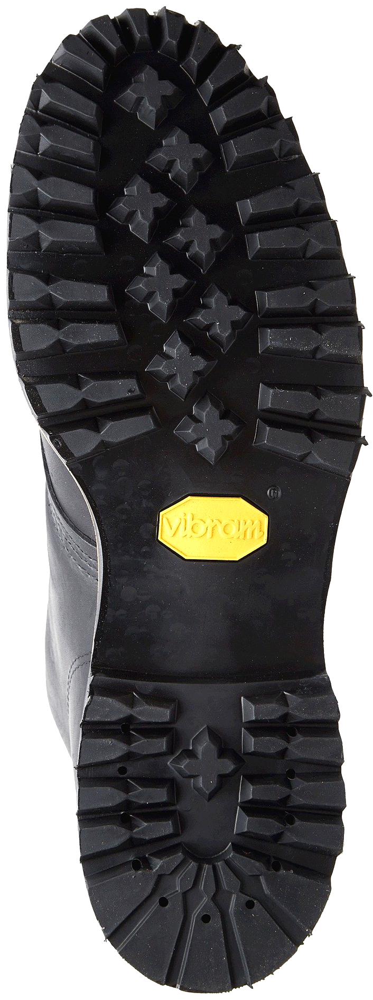


---
class:primary
## Relevant Features

<br/>
Geometric Elements in Shoe Tread
- One type of class characteristic
- Can be used to narrow shoe prints down to make/model where that information exists `r Citep(bb, 'gross_variability_2013')`

| Bowtie | Chevron | Circle |
| ------ | ------- | ------ |
|  |  |  |

| Line | Polygon | Quad |
| ---- | ------- | ---- |
|  |  |  |

| Star | Text | Triangle |
| ---- | ---- | -------- |
|  |  |  |

---
class: inverse
# <br/>Image Analysis and Feature Detection

---
class: primary
## Image Analysis

<br/>
### Goal: Identify geometric tread features in images of shoe outsoles

- Robust to different lighting conditions, rotation, image quality

- Quick to process new images

- Identified features should be explainable to practitioners

--

.center[]

---
class:primary
## Feature Detection

<br/>
#### Classic computer vision feature detection methods: 

- Edge, Corner, Blob, Ridge detection

- Template matching: Hough transforms 
    - line, circle, ellipse detection
    - provide location and orientation

--

.pull-left[
Pros
- No training data necessary
- Relatively simple algorithm
]

--

.pull-right[
Cons
- Not robust (fragile tuning parameters)
- Computationally intensive
- Features lack face validity
]

???

There are some computer vision methods that detect some of the geometric features we've identified. Edge and corner detection are used in image matching, blob detection is used everywhere from biology (identifying cells, nuclei, tumors) to astrophysics (galaxies and stars), and ridge detection is used to identify topographic features in images. More complicated features, such as lines, circles, and ellipses can be detected with Hough transforms, which are a template matching algorithm that's very computationally intensive. 

I spent some time trying to assemble some of these detectors to work with shoe outsole images and found that they were not robust - parameter settings that worked well for one image failed miserably when used on the same model of shoe with a slightly different color sole, the algorithms were slow, and the features they picked out were often not what I would call an edge or a corner - the algorithm was working at a much finer level than I was. As all of our work has to be explained to practitioners eventually, that made these methods sub-optimal. Google, Facebook, and many others have used convolutional neural networks to solve the image recognition problem in the past 10 years, so I moved on to the big guns. 

---
class:primary
## Feature Detection

<br/>
#### Convolutional neural networks: 
- Structure designed to mimic perceptual pathways in the human visual system
- Ubiquitous in modern image recognition tasks

--

.pull-left[

Pros
- Pre-trained networks available for tuning    
.small[AlexNet, VGG16, ResNet, Inception]
- Features are interpretable
- Very fast (after training)

]

--

.pull-right[

Cons
- Requires labeled training data (lots!)
- Computationally intensive to train
- Opaque - parameters are not interpretable

]

---
class:inverse
# <br/><br/>Convolutional Neural Networks

```{r labeled-data}
model_path <- "~/models/shoe_nn/TrainedModels/"

newest_model <- get_newest(dir = model_path, pattern = "weights.h5")
newest_data_file <- file.path("~/models/shoe_nn/RProcessedImages/", newest_model$process_dir, "cropped_photos.Rdata")

load(newest_data_file)

label_fixes <- c("triangles" = "triangle",
                 "trianglee" = "triangle",
                 "circlemtraignle" = "circle_triangle",
                 "circle triangle" = "circle_triangle",
                 "circleline" = "circle_line",
                 "circle text" = "circle_text",
                 "circle_elongated" = "circle",
                 "cricle|cirle" = "circle",
                 "chrevron" = "chevron",
                 "lie" = "line",
                 "texxt" = "text",
                 "star quad" = "star_quad",
                 "exc_idd" = "exclude",
                 "quad?" = "quad",
                 "qaud|qud" = "quad", 
                 "stars|start" = "star", 
                 "exlude" = "exclude",
                 "rounded" = "",
                 "smooth_texture" = "other",
                 "octagon" = "polygon",
                 "crepe" = "other",
                 "hex" = "polygon",
                 "smooth|hatching" = "other"
                 )
# Merge doesn't work, wtf???
annotated_imgs <- select(dfunion, image, name) %>%
  mutate(base_image = basename(image)) %>%
  mutate(num_labels = str_count(name, "_") + 1, 
         annot_num = 1:n()) %>%
  mutate(labels = str_remove_all(name, "\\(.{1,2}\\)") %>% 
           str_replace_all(label_fixes) %>% 
           str_split("_")) %>%
  unnest(labels) %>%
  mutate(labels = str_replace_all(labels, label_fixes)) %>%
  mutate(label_type = ifelse(num_labels == 1, "single", "multi")) %>%
  filter(labels != "") %>%
  filter(labels != "exclude") %>%
  filter(labels != "ribbon" & labels != "logo") %>%
  filter(labels %in% c(default_classes, "other"))
```

```{r}
new_img_dir <- dirname(newest_data_file)

ann_df <- select(annotated_imgs, base_image, name, num_labels, annot_num, labels, label_type) %>%
  group_by(base_image, name) %>%
  arrange(annot_num) %>%
  mutate(ln = 1:n())

img_df <- data_frame(img = list.files(file.path(new_img_dir, c("test", "train", "validation")), full.names = T)) %>%
  mutate(type = str_extract(img, "(test|train|validation)"),
         image = basename(img),
         aug = grepl("^aug", image),
         name = str_extract(image, "^([a-z\\(\\)RE]*?_?){1,}-\\d{1,}-"),
         ln = str_extract(name, "-\\d{1,}-$") %>% gsub(pattern = "-", replacement = "") %>% as.numeric(),
         name = gsub(pattern = "-\\d{1,}-$", "", name),
         name = gsub(pattern = "aug_", "", name),
         name = gsub(pattern = "logo|ribbon|logo\\(R\\)|ribbon\\(R\\)", replacement = "other", name),
         base_image = gsub(image, pattern = "^([a-z\\(\\)RE]*?_?){1,}-\\d{1,}-", replacement = "") %>%
           gsub(., pattern = "_\\d_\\d{1,}.jpg", replacement = ".jpg")) %>%
  select(type, base_image, name, ln, aug, img_path = image) %>%
  mutate(num_labels = str_count(name, "_") + 1, 
         annot_num = 1:n()) %>%
  mutate(labels = str_remove_all(name, "\\(.{1,2}\\)") %>% 
           str_replace_all(label_fixes) %>% 
           str_split("_")) %>%
  unnest(labels) %>%
  mutate(labels = str_replace_all(labels, label_fixes)) %>%
  mutate(label_type = ifelse(num_labels == 1, "single", "multi")) %>%
  filter(labels != "" & labels != "hatching" & labels != "exclude" & !is.na(labels))
```

```{r}
library(keras)
model_dir <- newest_model$path
load(list.files(model_dir, "-history.Rdata", full.names = T)[1])
load(file.path(get_newest()$path, get_newest(pattern = "\\d.Rdata")$base_file))
```

<!-- Add in information about what the layers are doing: https://www.overleaf.com/project/5bef1722f138c36ed9d572d4 -->
---
class:primary
## CNN Architecture - VGG16

<br/>
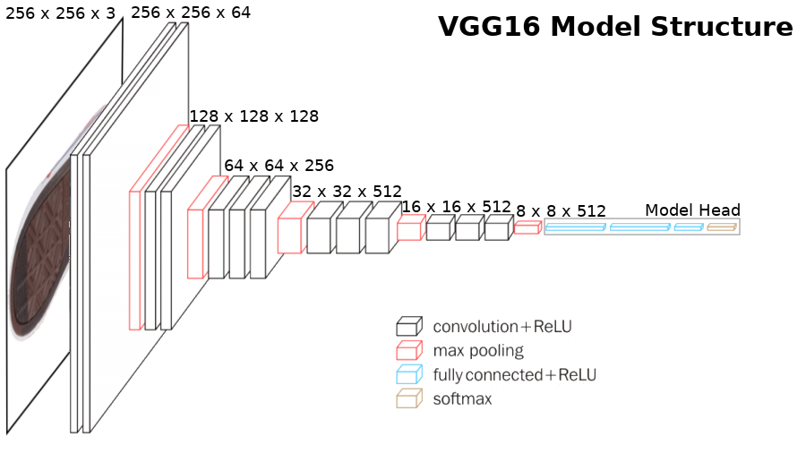

---
class: primary
## Convolutional Layers

<br/>

.moveleft[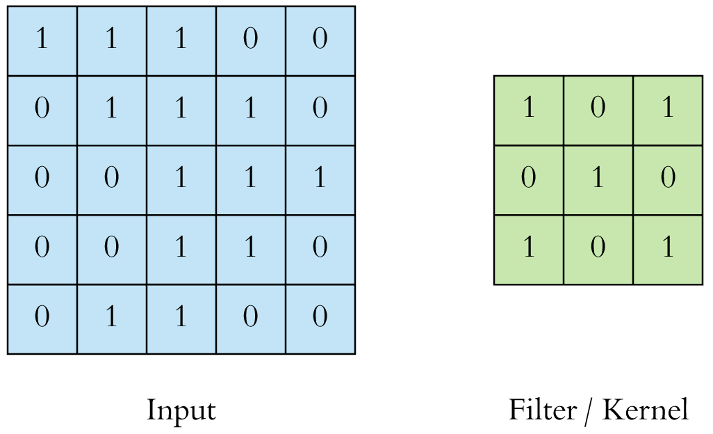]

.footer[Image source: https://towardsdatascience.com/applied-deep-learning-part-4-convolutional-neural-networks-584bc134c1e2]
---
class: primary
## Convolutional Layers

<br/>

.moveleft[]

.footer[Image source: https://towardsdatascience.com/applied-deep-learning-part-4-convolutional-neural-networks-584bc134c1e2]

---
class: primary
## Convolutional Layers

<br/>

.moveleft[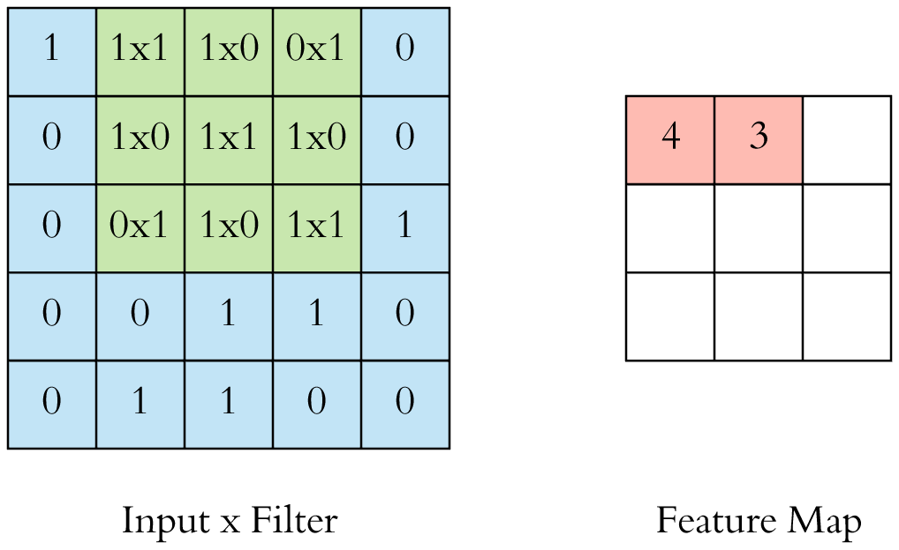]

.footer[Image source: https://towardsdatascience.com/applied-deep-learning-part-4-convolutional-neural-networks-584bc134c1e2]


---
class: primary
## Convolutional Layers

<br/>
For layer $\ell$ and cell $ij$, with weights $\mathbf{w}$ 

$$x^\ell_{ij} = \sum_{a=0}^{m-1}\sum_{a=0}^{m-1} w_{ab} y_{(i+a)(j+b)}^{\ell-1}$$

The  nonlinear activation function $\sigma(\cdot)$ is then applied: $y_{ij}^\ell = \sigma(x_{ij}^\ell)$ 

--

This is "Forward Propagation"

---
class: primary
## Max Pooling Layers

<br/>

.moveleft[]

.footer[Image source: https://towardsdatascience.com/applied-deep-learning-part-4-convolutional-neural-networks-584bc134c1e2]

---
class: primary
## Densely Connected Layers

<br/>

.moveleft[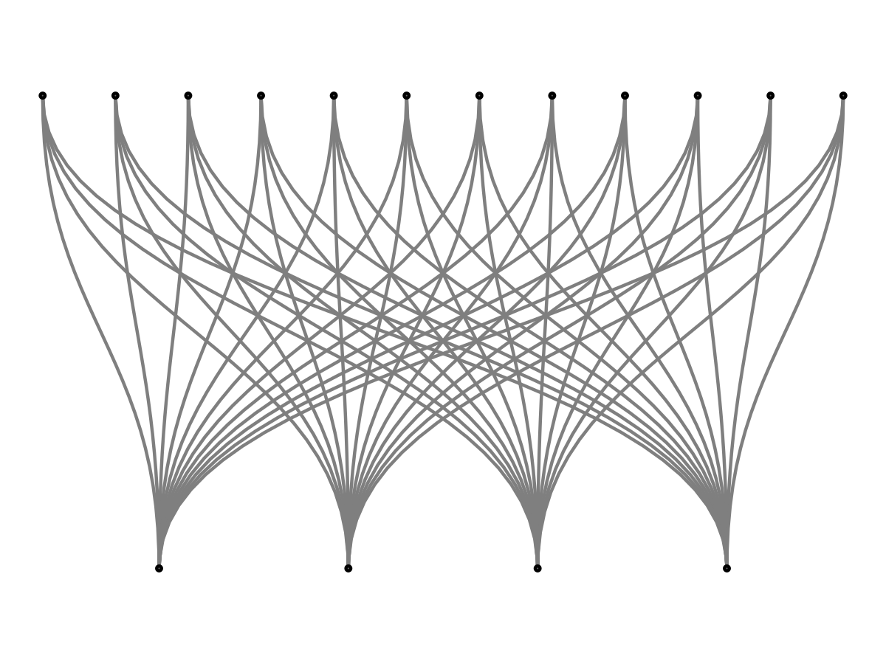]

---
class: primary
## Dropout Layers

<br/>

.moveleft[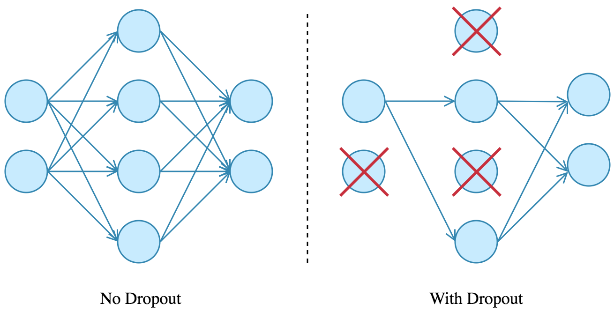]

.footer[Image source: https://towardsdatascience.com/applied-deep-learning-part-4-convolutional-neural-networks-584bc134c1e2]


---
class: primary
## Fitting Mechanism

<br/>

- Forward Propagation: Input -> Filters -> Pooling -> Result

- Backward Propagation: Errors -> Pooling -> Filters to modify weights
    - Loss function $L$ describing the prediction errors
    - Compute $\displaystyle\left(\frac{\partial L}{\partial y_{ij}^\ell}\right)$ for each cell in the previous layer
    

$$\left(\frac{\partial L}{\partial w_{ab}}\right) = \sum_{i = 0}^{N-m} \sum_{j=0}^{N-m} \frac{\partial L}{\partial x^{\ell}_{ij}} \frac{\partial x^\ell_{ij}}{\partial w_{ab}} = \sum_{i = 0}^{N-m} \sum_{j=0}^{N-m} \frac{\partial L}{\partial x^{\ell}_{ij}} y^{\ell-1}_{(i+a)(j+b)}$$

.footer[Source: http://andrew.gibiansky.com/blog/machine-learning/convolutional-neural-networks/]
---
class: primary
## Backward Propagation

<br/>

$\displaystyle \frac{\partial L}{\partial x^{\ell}_{ij}}$ is the gradient component:

$$\frac{\partial L}{\partial x^{\ell}_{ij}} = \frac{\partial L}{\partial y_{ij}^\ell}\frac{\partial y_{ij}^\ell}{\partial x_{ij}^\ell} = \frac{\partial L}{\partial y_{ij}^\ell} \frac{\partial }{\partial x_{ij}^\ell}\left(\sigma(x_{ij}^\ell)\right) = 
 \frac{\partial L}{\partial y_{ij}^\ell} \sigma'(x_{ij}^\ell)$$

$\displaystyle\frac{\partial L}{\partial y_{ij}^\ell}$ is error at the current layer, so the gradiant can be computed with the derivative of the activation function $\sigma(x)$

.footer[Source: http://andrew.gibiansky.com/blog/machine-learning/convolutional-neural-networks/]
---
class: primary
## Backward Propagation

<br/>
To propagate errors to the previous layer, 

$$\frac{\partial L}{\partial y_{ij}^{\ell -1}} = \sum_{a=0}^{m-1} \sum_{b=0}^{m-1} \frac{\partial L}{\partial x_{(i-a)(j-b)}^\ell}\frac{\partial x_{(i-a)(j-b)}^\ell}{\partial y_{ij}^{\ell-1}}
= \sum_{a=0}^{m-1} \sum_{b=0}^{m-1} \frac{\partial L}{\partial x_{(i-a)(j-b)}^\ell} \omega_{ab}$$

<br/>
.center[]

.center[<b>13 convolutional layers = a lot of backpropagation</b>]

.footer[Source: http://andrew.gibiansky.com/blog/machine-learning/convolutional-neural-networks/]

---
class: primary
## VGG16

<br/>
- Convolutional base of VGG16 for 256x256x3 input images has 14,714,688 parameters
- Head has 155,090,944 parameters and outputs 1000 different class label predictions, fit using 150,000 images

--

- We have 9 class labels and <25,000 labeled images
- Use the pre-trained VGG16 base (all of the convolutional layers) and train a new head
    - 8,391,177 parameters

???

Equivalent of putting a new "brain" on a set of "eyes" that's pre-trained

---
class: inverse
# Fitting CoNNOR: Convolutional Neural Network for Outsole Recognition

---
class:primary
## Acquire Data
<br/>
.moveleft[]

.move-margin[<br/><br/>`r system("tree /home/srvander/Projects/CSAFE/ShoeScrapeR/extra/photos/ | tail -1", intern = T) %>% str_extract("\\d{1,} files") %>% str_replace("files", "shoe outsole images")` scraped since June 2018]

---
class:primary
## Label Data

<br/>
.moveleft[.moveleft[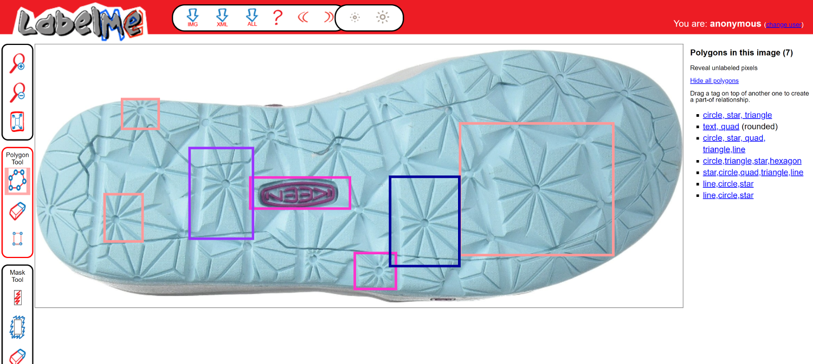]

- `r prettyNum(length(annotated_imgs$image), big.mark =  ",")` shoe images labeled

- `r prettyNum(length(unique(annotated_imgs$annot_num)), big.mark =  ",")` regions labeled with one or more geometric objects
]
--
.small[.move-margin[
<br/><br/>Labeling courtesy of 
- Jenny Kim
- Ben Wonderlin
- Holden Jud
- Mya Fisher
- Miranda Tilton
- Charlotte Roiger
- and others
]]

---
class:primary
## Label Data
<br/>
```{r, fig.width = 6, fig.height = 4, out.width = "99%", dpi = 300, fig.cap = "Distribution of classes in all labeled images. Quadrilaterals, lines, circles, text, and chevrons are relatively common; stars, polygons, and bowties are relatively uncommon."}
ggplot(data = annotated_imgs) + 
  geom_bar(aes(x = str_to_title(labels), fill = label_type), color = "black") + 
  scale_fill_manual("Class\nLabels", values = c("single" = "#6ba2b9", "multi" = "#2e5597")) + 
  coord_flip() + 
  ylab("# Labeled Regions") + 
  xlab("") + 
  theme(legend.position = c(1, 0), legend.justification = c(1, 0), legend.background = element_rect(fill = "transparent")) + 
  ggtitle("Current Class Distribution (All Labeled Images)")
```


---
class:primary
## Model Training

<br/>
<div style="margin-left:-20px">
- 256 x 256 pixel images

- Multiple classes, multiple labels: "One-hot" encoding    
.small["Dummy variables" in statistics-speak]

- Training data (60%):
    - 1x Augmented images (rotation, skew, zoom, crop) to prevent overfitting
    - Class weights used to counteract uneven class sizes
    
- Validation and test data (20% each)

- Fit using the `keras` package in R, which provides a high-level API for the `tensorflow` library .small[`r Citep(bb, 'chollet_deep_2018')`]
</p>

---
class:primary
## Model Training

<br/>
```{r training-accuracy, fig.width = 7.5, fig.height = 5, out.width = "99%", fig.cap = "Training and Validation accuracy and loss for each epoch of the fitting process. Training and validation accuracy reach 90% around epoch 14. After that point, validation loss remains about the same and training loss decreases slightly, while validation accuracy increases more slowly than training accuracy."}
data.frame(history$metrics) %>%
  mutate(epoch = 1:n()) %>%
  gather(key = "measure", value = "value", -epoch) %>%
  mutate(Type = ifelse(str_detect(measure, "val"), "Validation", "Training"),
         measure = ifelse(str_detect(measure, "acc"), "Accuracy", "Loss")) %>%
  # filter(Type == "Training") %>%
  ggplot(aes(x = epoch, y = value, color = Type)) + 
  geom_point() + 
  geom_smooth(se = F) + 
  facet_grid(measure~., scales = "free_y", switch = "both") + 
  theme(axis.title.y = element_blank(), legend.position = c(1, .5), legend.justification = c(1, 0),
        legend.background = element_rect(fill = "grey90")) + 
  scale_x_continuous("Epoch") + 
  ggtitle("CoNNOR Training Performance")
```

???

Validation loss levels off after 15 epochs, but hasn't yet begun to increase. Training loss is still decreasing as well. One concern with retraining the head of a CNN is that with relatively little data (e.g. 20 thousand data points instead of 20 million) it is easy to over-fit models; what we see is that this hasn't yet happened for this model. 

---
class:primary
## Evaluating the Model
<!-- Add in model overall AUC -->
<!-- Describe the multi-class version as splitting out model performance by class --> 

<br/>
```{r, fig.width = 7.5, fig.height = 5, out.width = "99%", fig.cap = "Receiver Operating Characteristic curves for the 9 classes used to fit CoNNOR, generated individually for each class."}
aucs <- plot_onehot_roc(preds, test_labs, str_to_title(classes))
aucs$plot + ggtitle("CoNNOR Test Set Performance") + 
  facet_wrap(~class, nrow = 2) + 
  coord_fixed() + 
  theme(legend.position = c(1, 0), legend.justification = c(1, 0))
```

???

The ROC curves shown here are calculated for each class without considering the other classes. Multi-class ROC curves exist, but do not allow for multi-label classification, so instead separate calculations were performed for each class independently. 

---
class:primary
## Evaluating the Model
<br/>
```{r ConfMatrix, message = F, warning = F, fig.width = 7.5, fig.height = 6.5, out.width = "85%", fig.cap = "Multi-class confusion matrix for CoNNOR. When an image has multiple labels, it is considered separately for each label; additional labels associated with the image are excluded from the calculation of incorrect predictions. The equal-error rate for each class (computed from the ROC curve on the previous slide) is used as a cutoff threshold (e.g. different classes have different thresholds. Most classes achieve greater than 75% prediction accuracy. The model predicts quadrilaterals with higher frequency than supported by the data for all classes."}
thresholds <- purrr::map_dbl(aucs$data$eer, ~.$thresholds)

get_confusion_matrix(preds, test_labs, str_to_title(classes), threshold = thresholds) %>%
  set_names(str_to_title(classes)) %>%
  ggcorrplot(., hc.order = F, outline.col = "white", lab = T) +
  scale_fill_gradient("Classification\nRate", low = "white", high = "cornflowerblue", limits = c(0, 1)) +
  scale_x_discrete("Reality") + scale_y_discrete("Prediction") +
  theme(axis.title.x = element_text(size = 14), axis.title.y = element_text(size = 14, angle = 90, vjust = 1)) +
  ggtitle("CoNNOR Multi-Class Confusion Matrix: Test Set Performance") + 
  theme(plot.margin = grid::unit(c(0,0,0,0), "mm"), plot.background = element_rect(fill = "transparent", color = NA),
        plot.subtitle = element_blank(), plot.caption = element_blank(), panel.spacing = unit(c(0, 0, 0, 0), "mm"))
```

.move-margin[

<br/>
For multi-label images, only incorrect predictions contribute to off-diagonal probabilities

Class Probability > Class EER used as the cutoff
<br/>

]

???

Slightly more likely to predict quadrilateral for all classes. It's important to note that we don't expect perfect predictions here - there are some shapes that are actually super ambiguous (and were labeled differently -- we're working on correcting that issue)

This is not a true confusion matrix, as the classes are not mutually exclusive and there are more than two. We've generalized the idea of a confusion matrix, where off-diagonal cells show errors, above-diagonal cells show incorrect classifications, and below-diagonal cells show missed classifications. For multi-label images, additional labels have been excluded from incorrect prediction calculations. Thus, if an image with a circle and a star was labeled with a circle but not a star, it would count as a correct classification for circle and as a missed classification for star, but not as a "circle labeled as a star". 

---
class:primary
## Definitions matter...

<br/>
.moveleft[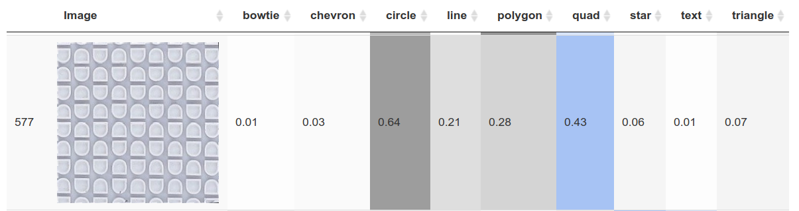]

--

.moveleft[]

???

We created a shiny application to see the images and the model's predictions. Blue means that the image had that label, grey means it does not. 

So in the first image, the design is labeled as a quadrilateral (rounded quadrilateral) rather than a circle. We're still debating how to handle these... 

In the second image, both text and quad are labels, but the model also identifies a circle in the text with probability 0.31; that is, the text contains an O. 

We use the shiny application to screen for these problems so that we can correct the labeled training data. We're trying to ensure that the data used to train the model is of very high quality, while not spending millions of dollars to hire workers online to label things. Because we determined the guidelines for labeling the data, labeled the data (or oversaw the labeling), and trained the model ourselves, we have the advantage of knowing the flaws at every point in the process; that means we have the responsibility to fix those flaws where possible. We're not doing inference on the model results at this point (nor planning to use the data we're training the model with during the operational stage) so the data -> model -> fix data loop is less of a validity concern. 

When the model is sufficiently well-calibrated, we can then work with engineers to build the device, collect some initial data, and tweak the model weights with new data that better represents what we'll actually see from the collection equipment. By that point, hopefully we'll also have narrowed down the geometric classification scheme so that categories that are now somewhat fuzzy are more clearly operationalized.

---
class:inverse
# What's Next?

---
class:primary
## Debugging the model

<br/>
- Active area of research: How to debug, interpret, and understand what a CNN is actually doing    
.small[https://distill.pub/2018/building-blocks/]

- Which regions in the image are relevant to the class?

- Which filters are most important for detection of each class?

```{r, include = F}
model_wts_file <- file.path(newest_model$path, newest_model$base_file)
loaded_model <- set_weights(model_wts_file)
image_dir <- file.path("/models/shoe_nn/RProcessedImages", newest_model$process_dir)
test_images <- list.files(file.path(image_dir, "images"), "*.jpg", full.names = T)
```

```{r, eval = F, include = F}
if (!dir.exists("heatmaps")) { dir.create("heatmaps")}
calc_heatmap(test_images[grepl("dc-pure-se-navy_product_7270757_color_9", test_images) & grepl("quad", test_images)][4], loaded_model) %>% create_composite(save_file = T, outdir = "heatmaps")
file.rename(from = "heatmaps/heatmap-quad(R)-4-dc-pure-se-navy_product_7270757_color_9.png", 
            to = "heatmaps/heatmap-quad-4-dc-pure-se-navy_product_7270757_color_9.png")
calc_heatmap(test_images[grepl("ugg-kids-bailey-bow-ii-toddler-little-kid-chestnut-pink-azalea_product_8920367_color_705035", test_images) & grepl("circle", test_images)], loaded_model, scale_by_prob = F) %>% create_composite(save_file = T, outdir = "heatmaps")
calc_heatmap(test_images[grepl("jambu-emma-black_product_9089180_color_3", test_images) & grepl("circle", test_images) & grepl("star", test_images)], loaded_model, scale_by_prob = F) %>% create_composite(save_file = T, outdir = "heatmaps")
calc_heatmap(test_images[grepl("adidas-kids-adilette-clf-adj-toddler-little-kid-big-kid-black-white_product_8987203_color_151.jpg", test_images) & grepl("text", test_images)], loaded_model, scale_by_prob = F) %>% create_composite(save_file = T, outdir = "heatmaps")
calc_heatmap(test_images[grepl("seychelles-slow-down-blush-metallic_product_9017725_color_34700.jpg", test_images) & grepl("text", test_images)][2], loaded_model) %>% create_composite(save_file = T, outdir = "heatmaps")
```

---
class:primary
## Debugging the model

<br/>
.left-column[For each class, the heatmap is scaled so that the highest value is highlighted in yellow ]
.right-column[
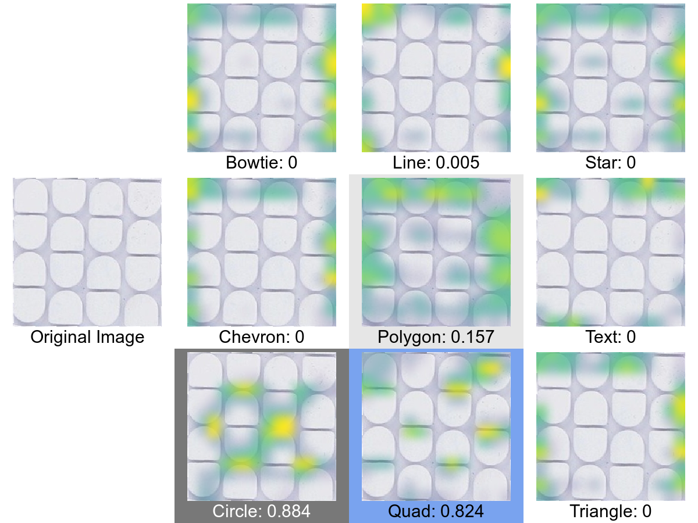
]

---
class:primary
## Debugging the model

<br/>
.left-column[For each class, the heatmap is scaled so that the highest value is highlighted in yellow ]
.right-column[
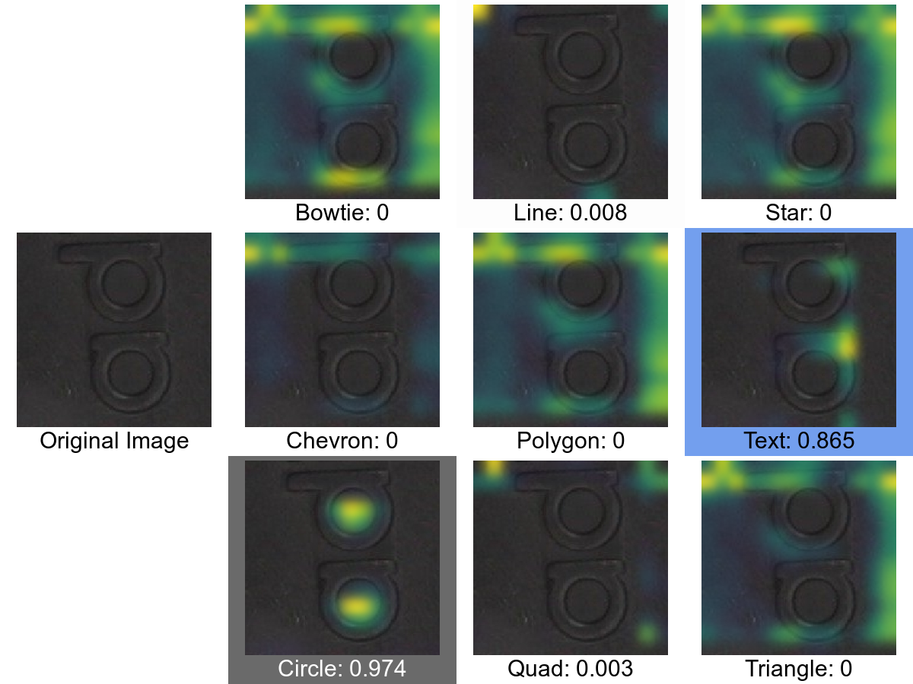
]

---
class:primary
## Debugging the model

<br/>
.left-column[For each class, the heatmap is scaled so that the highest value is highlighted in yellow ]
.right-column[
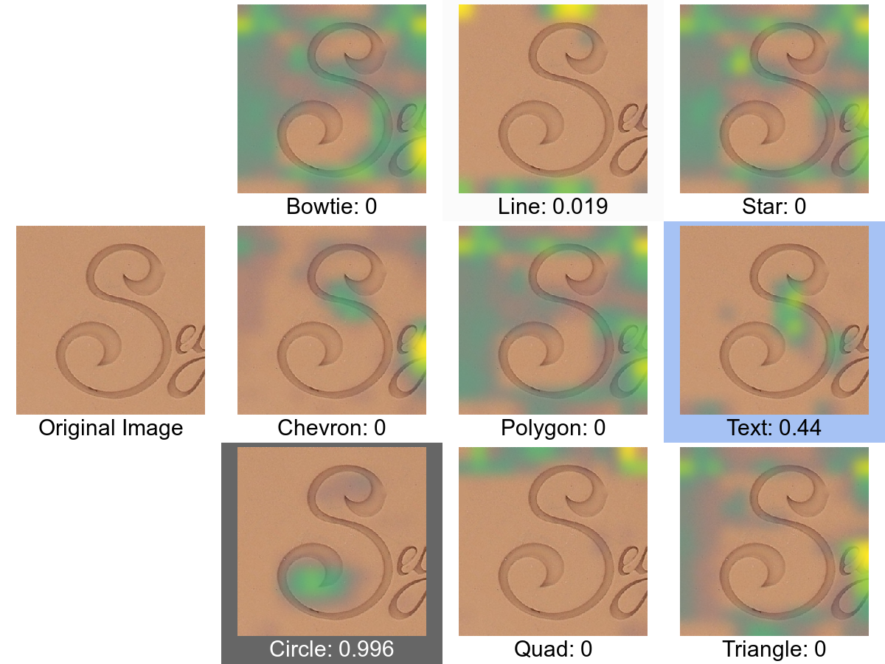
]

---
class:primary
## Debugging the model

- Port the keras-vis Python library to R (in progress!)
    - Activation Maximization maps: generate a new image to maximize filter output activations
        - Show what specific filters are doing and "seeing"
    - What parts of an image are most important in activating a specific class?
        - Saliency Maps: plot gradients w.r.t. output
        - Class Activation Maps: plot gradients w.r.t. last convolutional layer (maintains spatial information)
        
<!-- Insert Jason's stuff here -->        
---
class: primary
## Whole-Shoe class predictions

- Feed in a whole shoe, get back approximate coordinates of probable features

- Use spatial information to further discriminate between shoe models

---
class: primary
## 