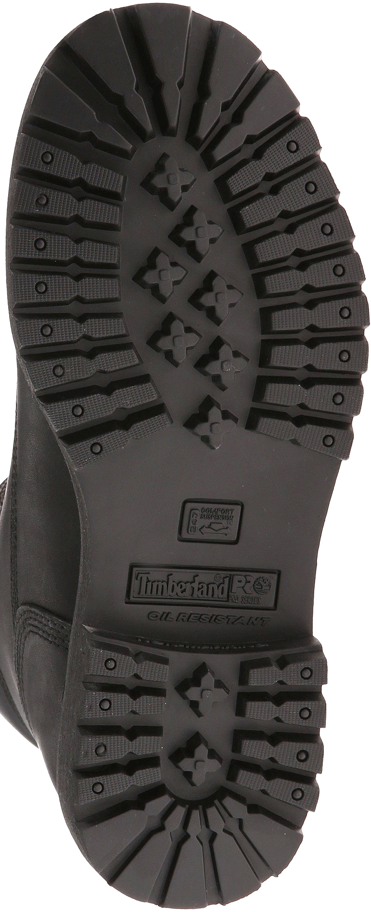
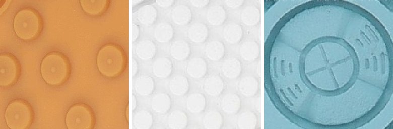
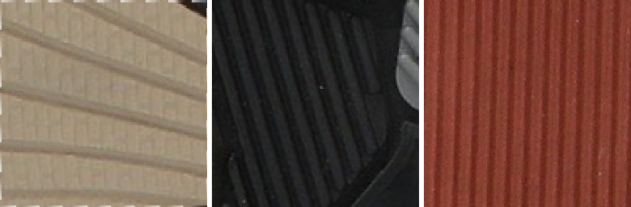
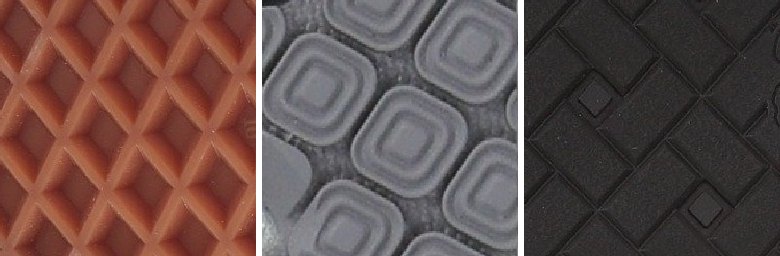
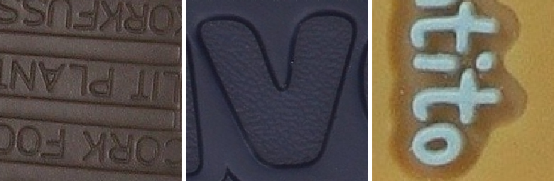
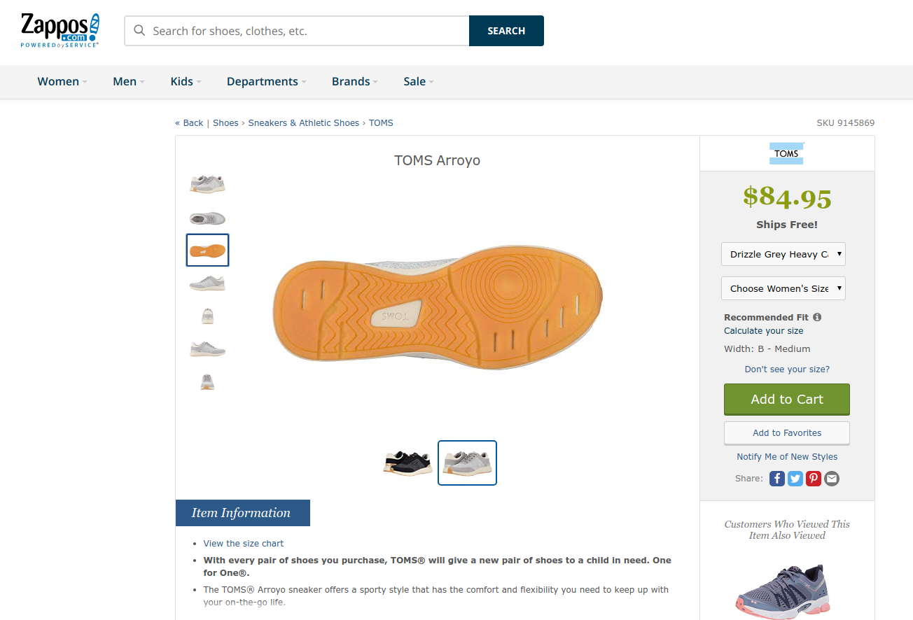

```{r, echo = F, cache = F, include = F}
library(tidyverse)
```
```{r, load_refs, echo=FALSE, cache=FALSE}
library(RefManageR)
BibOptions(check.entries = FALSE, 
           bib.style = "authoryear", 
           cite.style = 'alphabetic', 
           style = "markdown",
           hyperlink = FALSE, 
           dashed = FALSE)
bb <- ReadBib("./refs.bib", check = FALSE)
```

class:primary
## Outline

<br/>
- Defining the Problem
- Identifying features in shoes
- Convolutional Neural Networks
- Future Work

---
class:inverse
<h1><br/>What is the probability I made this shoeprint?</h1>

---
class:primary
## What is the probability I made this shoeprint?

1. Define the comparison population
2. Obtain data on the distribution of shoes in the comparison population
3. Identify shoes in the comparison population which could have produced the shoeprint
4. Establish whether I have any matching shoes

---
class:primary
## Comparison Population

.right-column[

<br/>
Geographic Area: 

- How local is local?

Time: 
- weekday, weekend
- morning, evening, overnight
- season

]

.left-column[


]
---
class:primary
## Comparison Population

<br/>
> .large[Quantifying the frequency of shoes in a local population is an unsolveable problem]<br/> - Leslie Hammer, March 2018


---
class:primary
## Comparison Population Shoes

- No 100% complete database of all shoes (manufacturer, model, size, tread molds)
    <!-- - Too many manufacturers, import/export, online sales, custom shoes, knockoffs -->
    <!-- - New shoes released all the time -->
- Shoe purchase data vs. frequency of wear
    <!-- - shoes purchased outside the defined geographic area or from non-participating retailers -->
    <!-- - frequency of wear -->
- Local populations may differ wildly
    <!-- - Styles and trends -->
    <!-- - Occupational differences -->
    <!-- - Retailer options -->

<br/><br/>
.center[]
<!-- https://pixnio.com/free-images/2017/05/03/2017-05-03-07-35-18-900x456.jpg -->

---
class:primary
## Comparison Population Shoes

How to collect data from the local population? 

- Low profile scanner that can be placed in a high traffic area
- Scan shoes of those walking past
- Create a local-area database of relevant shoes

--

### .center[This is an engineering problem]

---
class:primary
## Comparison Population Shoes

Assume a machine exists that can scan shoe outsoles of pedestrians

--

1. Identify relevant features within the images

--

2. Assess the frequency of similar shoes in local population data

--

### .center[These are statistics problems]

---
class:primary
## Identify Relevant Features

<br/>
Class Characteristics
- Make, Model, Tread pattern, Size, Type of shoe
- Cannot be used to identify an individual match
- Used for exclusion

---
class:primary
## Identify Relevant Features

<br/>
Use features other than make/model to characterize shoes

- Knockoffs often have very similar tread patterns
- Similar styles have similar tread patterns across brands
- Unknown shoes can still be classified and assessed




---
class:primary
## Identify Relevant Features

<br/>
Geometric Elements in Shoe Tread
- One type of class characteristic
- Can be used to narrow shoe prints down to make/model `r Citep(bb, 'gross_variability_2013')`

| Bowtie | Chevron | Circle |
| ------ | ------- | ------ |
|  |  |  |

| Line | Polygon | Quad |
| ---- | ------- | ---- |
|  |  |  |

| Star | Text | Triangle |
| ---- | ---- | -------- |
|  |  |  |

---
class:primary
## Feature Detection

<br/>
Classic computer vision feature detection methods: 
- Edge, Corner, Blob, Ridge detection
- Template matching: Hough transforms for line, circle, ellipse detection
    - provide location and orientation

--

.pull-left[

Pros
- Algorithmic; no training data necessary

]

--

.pull-right[

Cons
- Parameters don't generalize well to different images
- Computationally intensive to process every image
- Features lack face validity

]

---
class:primary
## Feature Detection

<br/>
Convolutional neural networks: 
- Structure built to mimic perceptual pathways in the human visual system
- Ubiquitous in modern image recognition tasks

--

.pull-left[

Pros
- Pre-trained networks available for tuning    
.small[AlexNet, VGG16, ResNet, Inception]
- Features are interpretable
- Very fast (after training)

]

--

.pull-right[

Cons
- Requires labeled training data (lots!)
- Computationally intensive to train
- Opaque - parameters are not interpretable

]

---
class:inverse
# <br/><br/>Convolutional Neural Networks

---
class:primary
## Acquire Data



.center[`r system("tree /home/srvander/Projects/CSAFE/ShoeScrapeR/extra/photos/ | tail -1", intern = T) %>% str_extract("\\d{1,} files") %>% str_replace("files", "shoe outsole images")` scraped since June 2018]

---
class:primary
## Label Data


.center[~25000 regions labeled with one or more geometric objects]

.center[Labeling courtesy of Jenny Kim, Ben Wonderlin, Holden Jud, and Mya Fisher]

---
class:primary
## Train the CNN

<br/>
- VGG16 pre-trained network    


---
class:primary
## Train the CNN

<br/>
- VGG16 pre-trained network    

- Tune parameters after the last convolutional layer; optimize for problem-specific input

---
class:primary
## Train the CNN

<br/>
- 256 x 256 images
- "One-hot" encoding - multiple classes are allowed for each image
- Training data (70%):
    - Augmented images (rotation, skew, zoom, crop) to prevent overfitting
    - Approximately equal numbers of images for each class
- Validation and test data (15% each)
    - Class frequency representative of population

