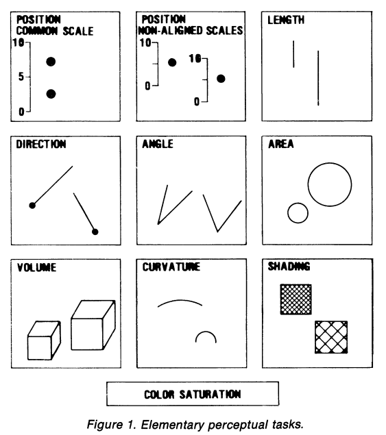
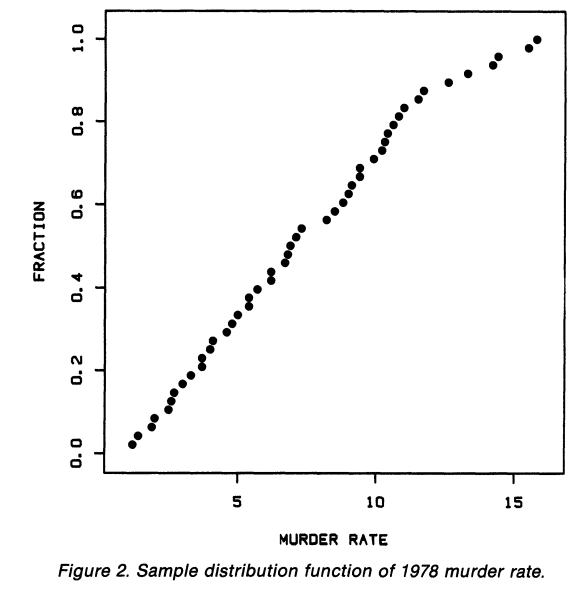
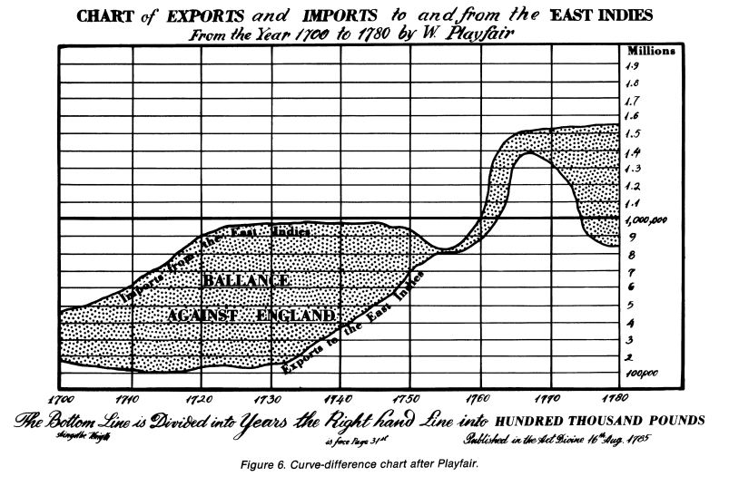
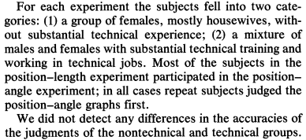
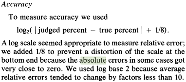

```{r setup, cache = F, echo = F, include = F}
knitr::opts_chunk$set(echo = F, message = F, warning = F)

library(tidyverse)
library(gridExtra)
```

# Perception of Graphical Elements

## Elementary Perceptual Tasks

<p class="double">
    
<br/>
"a viewer performs one or more of these mental-visual tasks to extract the values of real variables represented on most graphs"    
<br/>
Not pictured: color hue, texture
</p>

## Scatterplots

<p class="double">
    
<br/><br>
Goal: perceive relative magnitude of the values    
<br/>
Perceptual Task: compare position on a common scale
</p>

## Bar and Pie Charts
```{r bar-pie, include = F, fig.width = 4, fig.height = 2}
data <- data_frame(group = LETTERS[1:5],
                   val = c(92, 106, 83, 165, 58))
bar <- ggplot(data = data) + 
  geom_bar(aes(x = group, weight = val, fill = group), 
           color = "black") + 
  geom_text(aes(x = group, y = 0, label = group), vjust = -1) + 
  scale_x_discrete(expand = c(0.05, 1)) + 
  guides(fill = F) + 
  theme_minimal() +
  theme(axis.title = element_blank(), axis.text.x = element_blank())

pie <- ggplot(data = data, aes(x = "", y = val, fill = group, label = group)) + 
  geom_bar(stat = "identity",
           color = "black", 
           width = 1) + 
  geom_text(position = position_stack(vjust = 0.5)) + 
  guides(fill = F) + 
  coord_polar(theta = "y") +
  theme_void()

grid.arrange(bar, pie, ncol = 2)
```

<p class="double">
    
<br/>
<b>bar</b>: position/length along a common scale, also area
<br/>
<b>pie</b>: angle (arc length, area)
</p>

## Bar Charts


|       |       |       |           |           |
|:-----:|:------|:-----|:-------|:-----:|
| position | position | position | length | length |


## Maps


## Curve Differences



## Curve Differences

<b>Import and Export values</b>: position on a common scale    
<br/>
<b>Trade Imbalance</b>: length/vertical distance

<p class="note">Cleveland and McGill don't account for perceptual illusions. We aren't perceiving length, but diagonal width </p>

## Cartesian Plots

```{r, out.width = "100%", fig.width = 7.5, fig.height = 2.5}
data <- data_frame(x = rep(1:10, 2) + runif(20, 0, 1), 
                   y = -1/8*(x - 10)^2 + 10 + rnorm(20, 0, .5), 
                   num = rep(1:10, 2)) %>%
  arrange(x, y)
plot1 <- qplot(x, y, data = data) + 
  ggtitle("Actual Plot") + 
  theme(axis.title = element_blank(), axis.text = element_blank())

plot2 <- ggplot() + 
  geom_smooth(aes(x = x, y = y), data = data, method = "loess", se = F) + 
  geom_point(aes(x = x, y = y), data = data, inherit.aes = F) + 
  ggtitle("Percieved plot") + 
  theme(axis.title = element_blank(), axis.text = element_blank())

data_connect <- data %>%
  arrange(x, y) %>%
  mutate(num = (1:n())/2) %>%
  gather(key = var, value = value, -num) %>%
  arrange(num)

plot3 <- ggplot() + 
  geom_bar(aes(x = num, y = value, fill = var),
           color = "black",
           data = data_connect, stat = "identity", position = "dodge", width = .4) + 
  scale_fill_manual("Variable", values = c("grey80", "grey20")) + 
  theme(legend.position = c(0, 1), legend.justification = c(0, 1), legend.background = element_rect(fill = "transparent"), axis.title = element_blank(), axis.text = element_blank()) + 
  ggtitle("X-Y without implicit slope")

grid.arrange(plot1, plot2, plot3, nrow = 1)
```

> With the ability to perceive slopes removed, the pattern of the nonlinear relationship is difficult to perceive


## Accuracy

|  |  |
| :--- | :--- |
| &nbsp; | &nbsp; |
| 1. Position along a common scale | (most accurate) |
| 2. Positions along nonaligned scales | |
| 3. Length, direction, angle | |
| 4. Area | |
| 5. Volume, curvature | |
| 6. Shading, color saturation | (least accurate) |
| &nbsp; | &nbsp; |

## Experimental Subjects



## Accuracy Measure



## Accuracy Measure

```{r accuracy, fig.height = 4, fig.width = 8}
fx <- function(x1, x2) {
  log(abs(x1 - x2) + 1/8)/log(2)
}
finv <- function(x, y) {
  2^y - 1/8
}

data <- expand.grid(x2 = seq(0, 100, 1), x1 = seq(0, 100, 10)) %>%
  mutate(f = fx(x1, x2),
         error = x1 - x2)

# ggplot(data = data) + 
#   geom_line(aes(x = x2, y = f, group = x1, color = factor(x1))) + 
#   ylab("log2(absolute error + .125)") + 
#   xlab("True Percent") + 
#   scale_color_discrete("Judged\nPercent")

ggplot(data = filter(data, f < 3.5, f > 0)) + 
  geom_line(aes(y = error, x = f, group = sign(error))) + 
  ylab("Linear Error") +
  xlab("log2(Absolute Error + .125)")
```

## Positions and Angles - Average Error


## Positions and Angles - Average Error
```{r, fig.height = 4, fig.width = 8}
angledf <- tribble(
  ~x, ~y, ~area, ~moment,
  10.067251461988292, -0.8211754170479111, 45, 424.4444444444445,
10.88116703796528, 0.3972482840166838, 48, 441.64583333333377,
12.456140350877188, 1.3764097744360906, 0, 0,
12.631578947368414, 1.458020050125313, 0, 0,
14.210526315789469, 1.2741451843895453, 0, 0,
15.614035087719298, 1.080088614393126, 0, 0,
20.1957545378598, 0.884196542880082, 44, 394.6136363636366,
23.30821142691243, 1.61903184681683, 94, 3049.4574468085116,
26.889097744360896, 2.208305252637624, 44, 392.1363636363637,
30.115179925121446, 1.141481788923684, 45, 409.4222222222222,
30.285894997541128, 2.2914613159249013, 47, 442.4680851063827,
34.03508771929824, 2.149167561761547, 0, 0,
36.37137597079117, 2.4865265862912507, 45, 408.0888888888886,
38.24561403508772, 2.1384264232008596, 0, 0,
41.929824561403514, 2.097140171858217, 0, 0,
42.28070175438596, 2.260360723236663, 0, 0,
46.66666666666667, 2.4026584317937703, 0, 0,
48.6443539404066, 3.3138813809253866, 48, 460.7291666666662,
50.06130870912506, 2.7279350062115544, 47, 439.65957446808505,
50.40246591535528, 1.025535787282195, 49, 457.4693877551014,
52.28070175438597, 2.432554600787684, 0, 0,
52.98245614035088, 2.330424274973147, 0, 0,
55.08771929824562, 2.2893394199785178, 0, 0,
58.59649122807018, 2.8297081990691018, 0, 0,
60.70175438596492, 2.890664160401003, 0, 0,
62.10526315789474, 2.55375044754744, 0, 0,
65.61775816352475, 3.383755517435263, 46, 425.32608695652175,
71.2280701754386, 2.9811582527747946, 0, 0,
72.28070175438597, 2.8993913354815612, 0, 0,
77.19298245614036, 2.388560687432868, 0, 0,
78.7719298245614, 2.4291756176154675, 0, 0,
79.6784070104339, 2.156262781401688, 47, 457.1063829787231,
85.43859649122808, 2.3466926244181887, 0, 0,
87.01754385964912, 2.387307554600788, 0, 0,
87.3157430613571, 2.5854077689973236, 45, 407.77777777777715,
93.12398905064082, 2.982710152996836, 47, 427.744680851064,
98.70937263794407, 0.8483360002782416, 49, 442.12244897959147,
99.30308796683066, 1.2251324152375154, 45, 411.2888888888883,
99.81334509112287, 0.5828994589806586, 45, 396.355555555556,
) %>%
  mutate(abserr = finv(x, y))
  
linedf <- tribble(
  ~x, ~y, ~area, ~moment,
  14.267560079229245, 1.1567947255204514, 55, 631.0909090909086,
23.7965220113429, 1.5149702124088993, 54, 536.9629629629628,
27.20150042289562, 1.3020826984308855, 59, 718.6440677966107,
42.39562934517884, 1.36989937058572, 109, 2898.550458715598,
52.515561092404724, 1.1503036619235187, 52, 507.74999999999966,
58.49474652355303, 1.247737231123307, 52, 442.28846153846104,
11.046946299208539, 0.9968354430379742, 0, 0,
13.025342236200984, 1.4240506329113924, 0, 0,
12.694320554796462, 1.3291139240506324, 0, 0,
15.954523189564053, 1.3575949367088604, 0, 0,
20.443424682255277, 0.009493670886075556, 0, 0,
10.24362577019258, -1.7943037974683547, 0, 0,
30.06780272757741, 0.21835443037974667, 0, 0,
30.416355152233876, 0.6360759493670884, 0, 0,
50.70251875531724, -0.84493670886076, 0, 0,
48.50344169738844, 0.664556962025316, 0, 0,
50.308077032148276, 0.8924050632911391, 0, 0,
54.710356028771045, 0.9493670886075947, 0, 0,
52.78300549124752, 1.462025316455696, 0, 0,
42.02944133646137, 1.462025316455696, 0, 0,
38.454716543349925, 1.6424050632911387, 0, 0,
36.514991363530896, 1.9272151898734173, 0, 0,
34.409239732913974, 2.15506329113924, 0, 0,
46.599293614168964, 1.6044303797468351, 0, 0,
61.379772615947815, 0.7499999999999996, 0, 0,
62.20681120936348, 0.9778481012658222, 0, 0,
65.69955399726726, 2.287974683544303, 0, 0,
86.5049369666658, 1.367088607594936, 0, 0,
93.52187475830777, 1.5664556962025311, 0, 0,
87.20204181597875, 2.2025316455696196, 0, 0,
85.4819665369048, 0.5316455696202529, 0, 0,
79.28330196705251, 0.3987341772151898, 0, 0,
98.65528887055608, 0.08544303797468356, 0, 0,
99.61999535950915, -0.1518987341772151, 0, 0,
99.11572868596768, -0.4367088607594942, 0, 0,
72.018355719405, 1.6329113924050631, 0, 0,
71.03199360643481, 1.4715189873417716, 0, 0,
77.22704890561756, 1.5379746835443036, 0, 0,
78.37118770785533, 1.6044303797468351, 0, 0,

) %>%
  mutate(abserr = finv(x, y))

p1 <- qplot(x = x, y = abserr, geom = "point", data = linedf) + 
  geom_smooth(aes(x = x, y = abserr)) + 
  ylab("Absolute Error") + 
  xlab("True Percent") + 
  ggtitle("Positions")

p2 <- qplot(x = x, y = abserr, geom = "point", data = angledf) + 
  geom_smooth(aes(x = x, y = abserr)) + 
  ylab("Absolute Error") + 
  xlab("True Percent") + 
  ggtitle("Angles")

grid.arrange(p2, p1, nrow = 1)
```

## Positions and Angles


## Positions and Angles


