class: primary
```{r setup, echo = F, cache = F, include = F}
library(magrittr)
library(tidyverse)
library(ggplot2)
mytheme <- theme_bw() + 
  theme(panel.grid.major = element_line(color = "grey50"),
        panel.grid.minor = element_line(color = "grey60"))

theme_set(mytheme)
knitr::opts_chunk$set(echo = FALSE, message = F, warning = F, cache = T, dpi = 300, dev = 'png')

```

```{r load_refs, echo=FALSE, cache=FALSE, include = F}
library(RefManageR)
BibOptions(check.entries = FALSE, 
           bib.style = "numeric", 
           cite.style = 'authoryear', 
           style = "html",
           hyperlink = FALSE, 
           no.print.fields = c("isbn", "urldate", "note", "file"),
           dashed = FALSE)

bb <- ReadBib("./refs.bib", check = T)

optslist <- list(max.names = 1, longnamesfirst = F)

custom_print_bib <- function(before, ref, after, ...) {
  cat(before)
  print(ref, ...)
  cat(after)
}

custombib <- function(bibref, before = "- ", after = "", ...) {
  tibble::tibble(before = before, ref = bibref, after = after) %>%
    purrr::pwalk(custom_print_bib, ...)
}
```

## True or False? 
### Macadamia nuts are in the same family as peaches

.center[


]


---
class:primary
## History

.center[
[](http://www.cc.com/video-clips/63ite2/the-colbert-report-the-word---truthiness)]

---
class: primary
## Truthiness

.large[The belief that a statement is true based on intuition, without regard to evidence, logic, or facts. ]

- Statement evaluation depends on 

    - rational evaluation of the statement itself

    - feelings about the source of the statement

    - feelings about the statement and associations with similar topics
    
.move-margin[
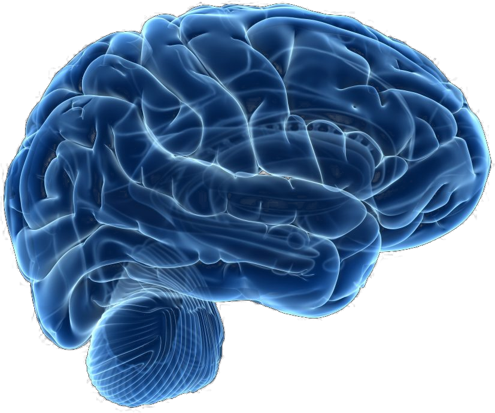

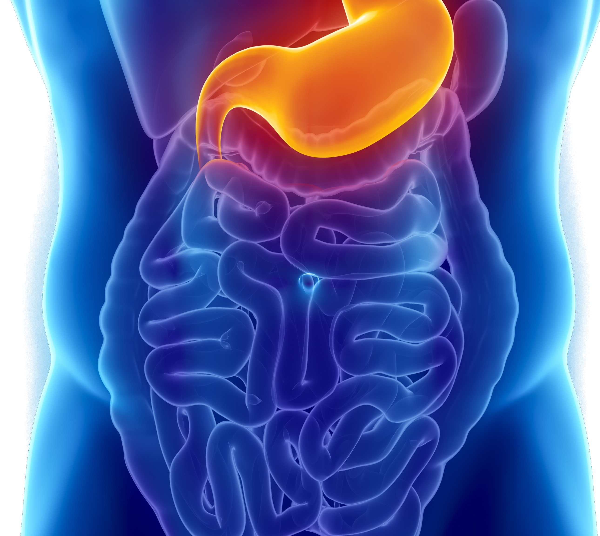

]

---
class:primary
## Experimental Evidence

```{r, results = 'asis'}
custombib(bb["mccabeSeeingBelievingEffect2008"], before = "- ", .opts = list(bib.style = "authoryear"))
```

Experiment 1: Extra information with summaries of cognitive neuroscience research

- Summaries made conclusions not supported by the data (reverse inference errors)

- Participants evaluated 
    1. Article was well written
    2. The title was a good description of the results
    3. The scientific reasoning in the article made sense


---
class:primary
## Experimental Evidence

```{r, results = 'asis'}
custombib(bb["mccabeSeeingBelievingEffect2008"], before = "- ", .opts = list(bib.style = "authoryear"))
```

.pull-left[Experiment 1 Result: 

  - Brain image and bar graph "better written" than control
  - No difference in title evaluation
  - Higher ratings for scientific reasoning in article w/ brain image (no difference for bar graph)
]
.pull-right[
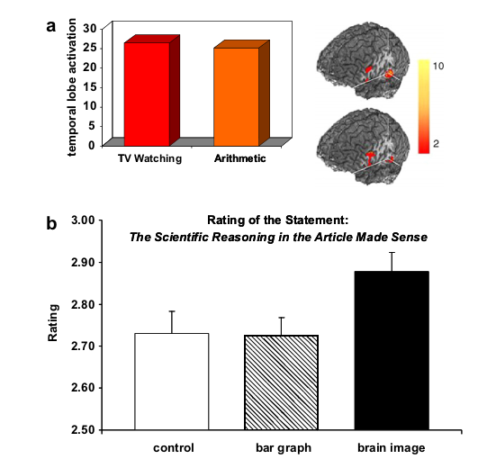
]


--

.move-margin[<br/><br/><br/>Brain images are more complex than the bar graphs - could that be it?]

---
class:primary
## Experimental Evidence

```{r, results = 'asis'}
custombib(bb["mccabeSeeingBelievingEffect2008"], before = "- ", .opts = list(bib.style = "authoryear"))
```

.pull-left[Experiment 2: Provide (topological activation map / brain image) along with summaries of cognitive neuroscience research

- Participants rated only the soundness of scientific reasoning in the article
].pull-right[

]

---
class:primary
## Experimental Evidence

```{r, results = 'asis'}
custombib(bb["mccabeSeeingBelievingEffect2008"], before = "- ", .opts = list(bib.style = "authoryear"))
```

[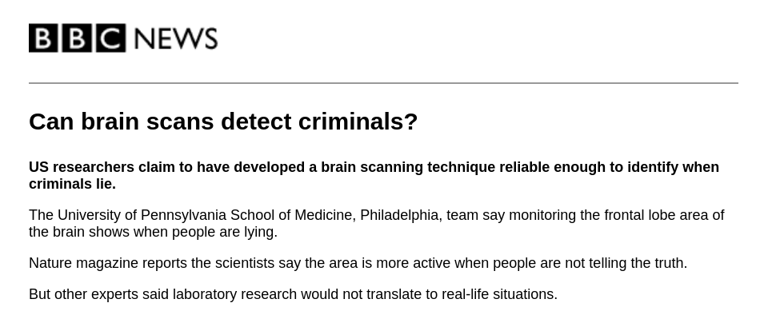](http://news.bbc.co.uk/2/hi/uk_news/4268260.stm)


---
class:primary
## Experimental Evidence

```{r, results = 'asis'}
custombib(bb["newmanNonprobativePhotographsWords2012"], before = "- ", .opts = list(bib.style = "authoryear"))
```


__Experiment 1 (a/b):__ "\_\_\_\_ is (alive/dead)" x (familiarity) x (photo)

- Half of the celebrities were alive, half dead    
(matched on familiarity scores)
- With a photo, people were more likely to say claim was true    
(stronger effect for more unfamiliar names)

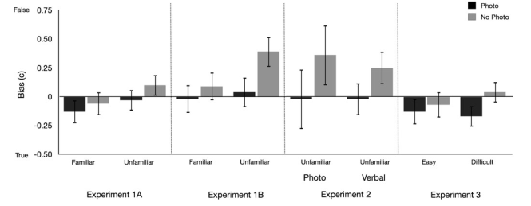

---
class:primary
## Experimental Evidence

```{r, results = 'asis'}
custombib(bb["newmanNonprobativePhotographsWords2012"], before = "- ", .opts = list(bib.style = "authoryear"))
```

__Experiment 2:__ "\_\_\_\_\_ is (alive/dead)" x (photo / verbal description)

  - Nonprobative information = higher probability that claim is rated as true 
  
  - Format (verbal/photo) not significant


---
class:primary
## Experimental Evidence

```{r, results = 'asis'}
custombib(bb["newmanNonprobativePhotographsWords2012"], before = "- ", .opts = list(bib.style = "authoryear"))
```

__Experiment 3:__ (trivia statement) x (photo/no photo) x (easy/hard)

  - Photos showed grammatical subject of the statement
  
  - Photos produced a "truthiness effect" (statements with photos were rated true more frequently)
    


---
class:primary
## Experimental Evidence

```{r, results = 'asis'}
custombib(bb["newmanNonprobativePhotographsWords2012"], before = "- ", .opts = list(bib.style = "authoryear"))
```

Conclusions: 

- Pseudoevidence (photo or verbal) generated from extra information

- Semantic priming (activating related information) may produce the feeling of "truth"    
(ease of accessing the information)

- Mental generation of evidence consistent with a hypothesis alters accuracy of inferences about the hypothesis

---
class: primary
## Cognitive Sequence
.move-margin[


]

1. What do I know about this topic?

    - Search for facts associated with the statement
    - Note how easy it is to retrieve related information (meta-cognition)
--

2. Are the things I know about this topic consistent with the statement?

--
3. What do I know about the source of the statement?

    - Evaluate the reliability of the source

---
class:inv-center
# Does this hold for graphs and charts?

---
class:primary
## Arguments and <br/>Considerations

- Bar charts didn't produce much of an effect in `r Citep(bb, "mccabeSeeingBelievingEffect2008", .opts = optslist)`

- Semantic priming
  - related charts might not have enough priming effect, but `r Citep(bb, "newmanNonprobativePhotographsWords2012", .opts = optslist)` showed some truthiness effect for verbal information
  - Some charts (or maps) contain a rich set of information that may activate semantic (or visual) priming

- Do people even read charts correctly to answer questions?

--

.center[Yes, unfortunately, we do have to ask]

---
class:primary
## Step 1: Get some trivia statements

### Spatial data only
1. Egypt has approximately the same length of land border and coastal border
2. Brazil is the 5th largest country by area
3. Paraguay is landlocked
4. Russia has the longest coastal border (in km) of any country
5. Eswatini, also known as Swaziland, is landlocked and only borders one country
6. Seven countries border the Black Sea


---
class:primary
## Step 1: Get some trivia statements

### Additional data required
1. Over 50% of Qatar's population are men between 25 and 54 years old
2. At least three South American countries get more than 50% of their electricity from hydroelectric generation
3. Over 95% of Belgium's population lives in urban areas
4. Less than 85% of the population of Belize has access to electricity
5. Switzerland is one of three European countries who get more than 30% of their power from nuclear power plants.
6. South Africa has the lowest proportion of children (under 15) of all African nations

---
class:primary
## Step 2: Assemble pictures

<table>
<tr>
<td width = "33%">fact alone</td>
<td width = "33%">unrelated picture</td>
<td width = "33%">related picture</td></tr>
<tr><td width = "33%"></td><td width = "33%"></td><td width = "33%"></td></tr>
<tr><td width = "33%">unrelated chart</td><td width = "33%">related chart (np)</td><td width = "33%">related chart (p)</td></tr>
<tr><td width = "33%">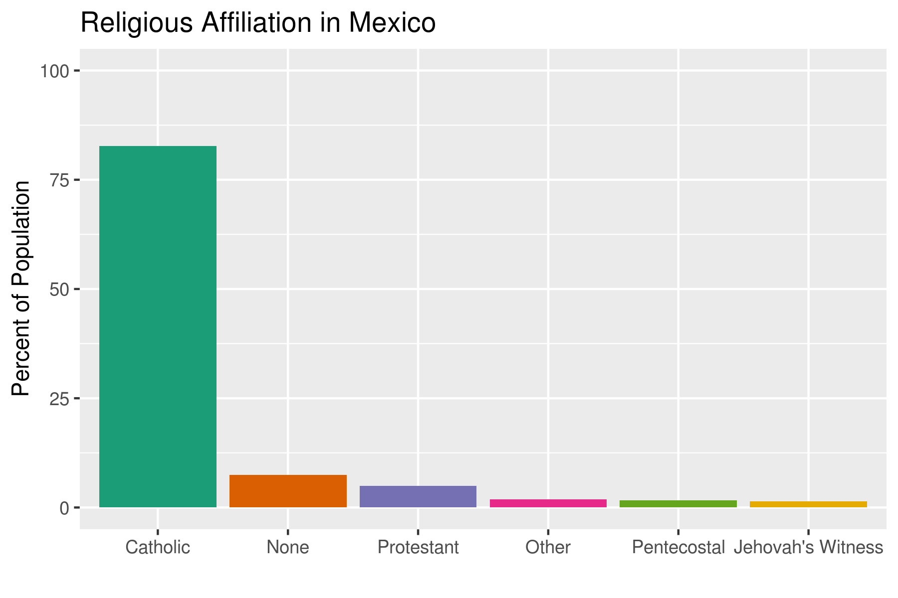</td><td width = "33%">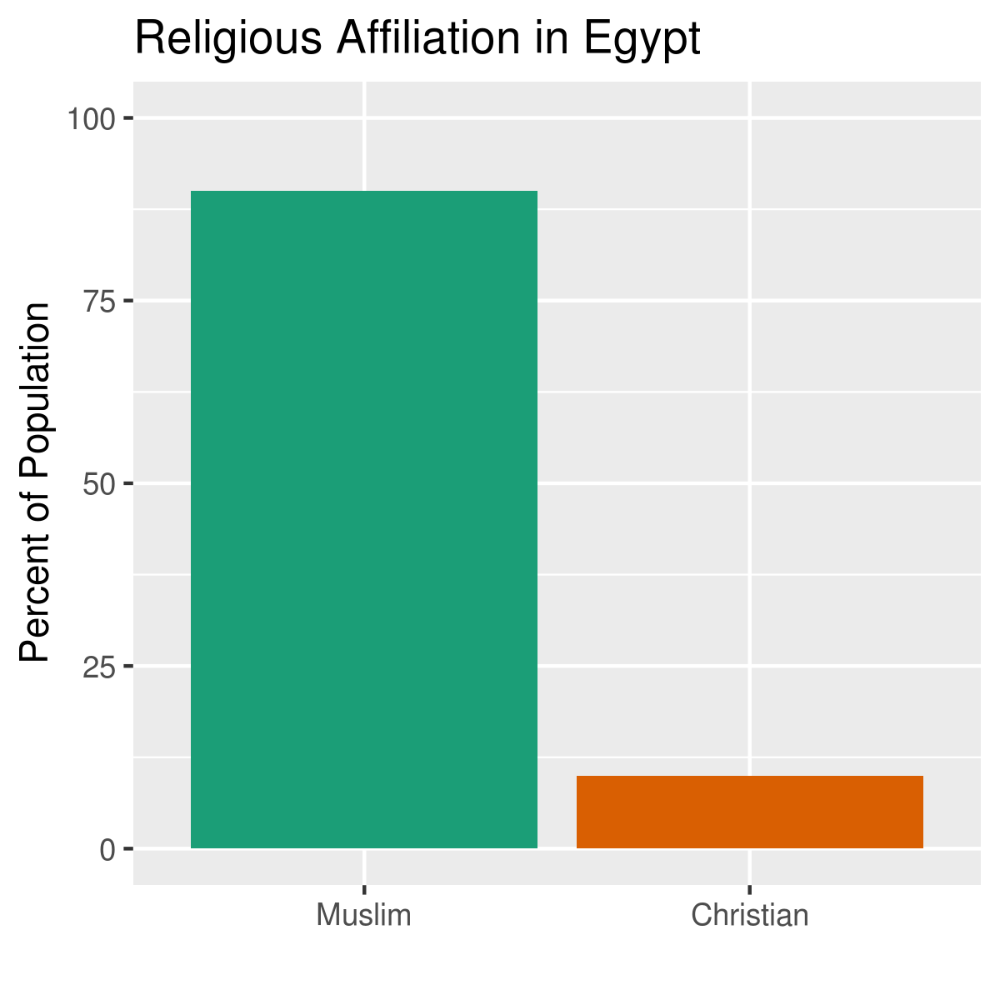</td><td width = "33%">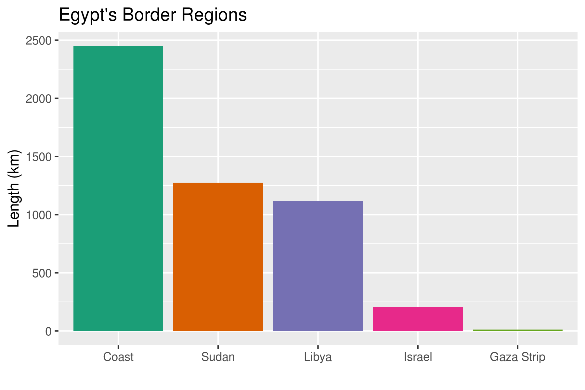</td></tr>
<tr><td width = "33%">unrelated map</td><td width = "33%">related map (np)</td><td width = "33%">related map (p)</td></tr>
<tr><td width = "33%">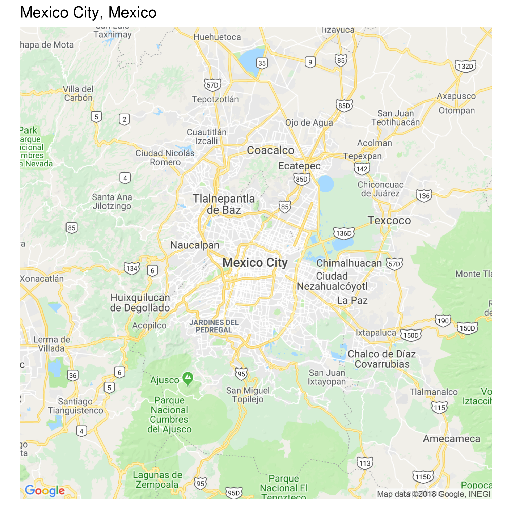</td><td width = "33%">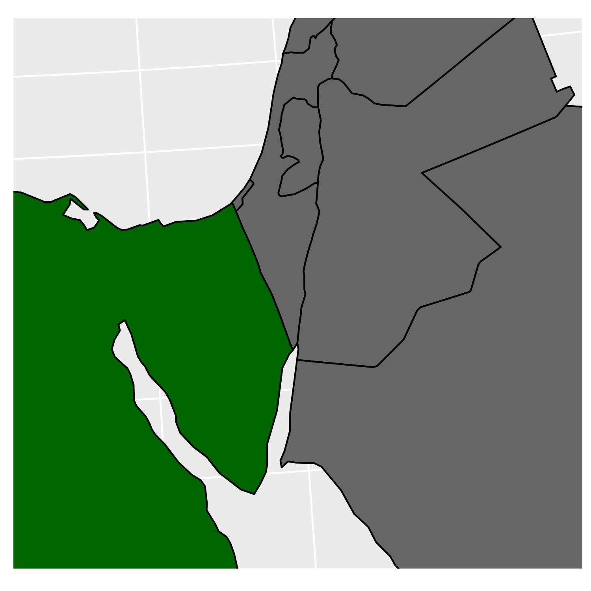</td><td width = "33%">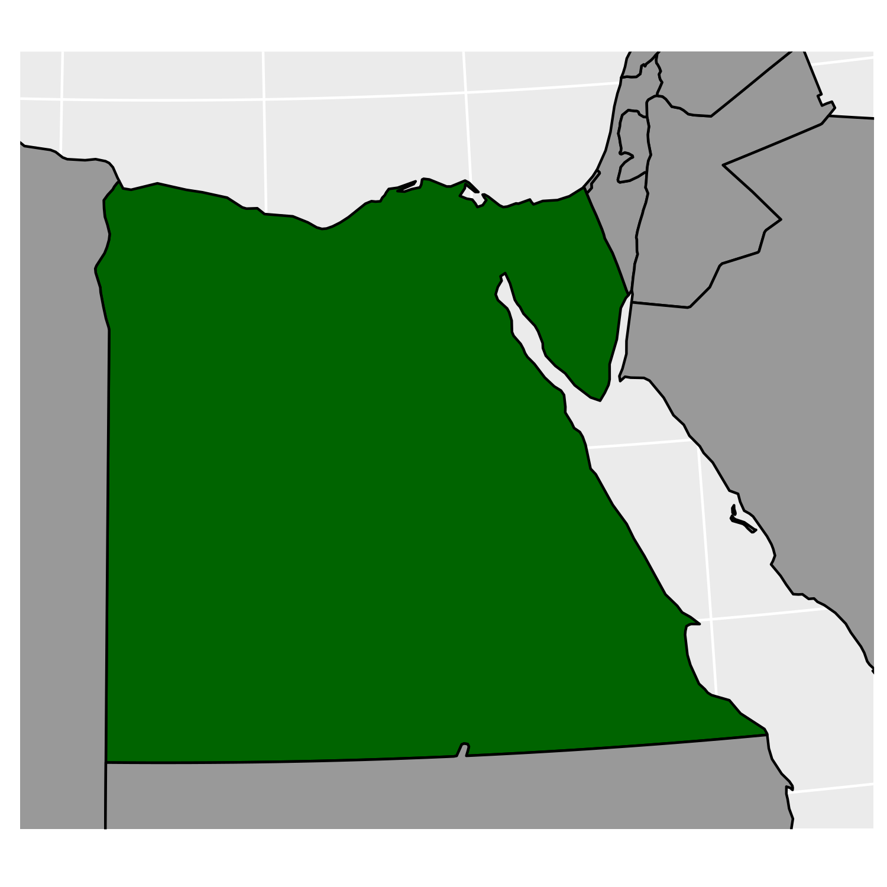</td></tr>
</table>

---
class:primary
## Step 3: Validate setup<br/>Pilot Study!

- 42 undergraduates

- "Talk out loud" study - think out loud through deciding whether the statement is true or false

- Transcriptions of the audio for reference

[See results](https://bigfoot.csafe.iastate.edu:442/srvander/TruthinessDataViewer/)