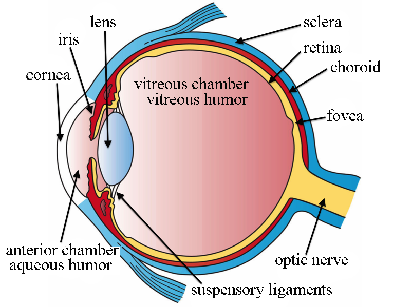
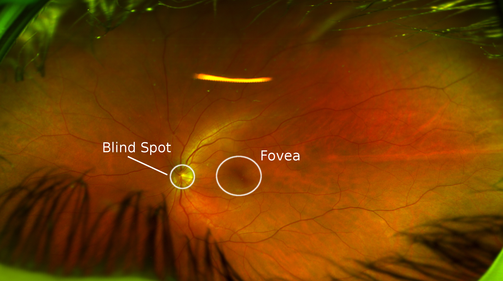
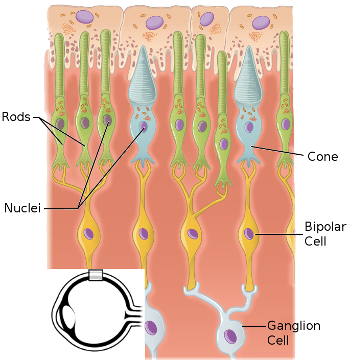
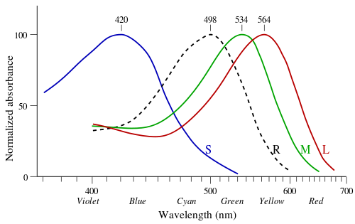
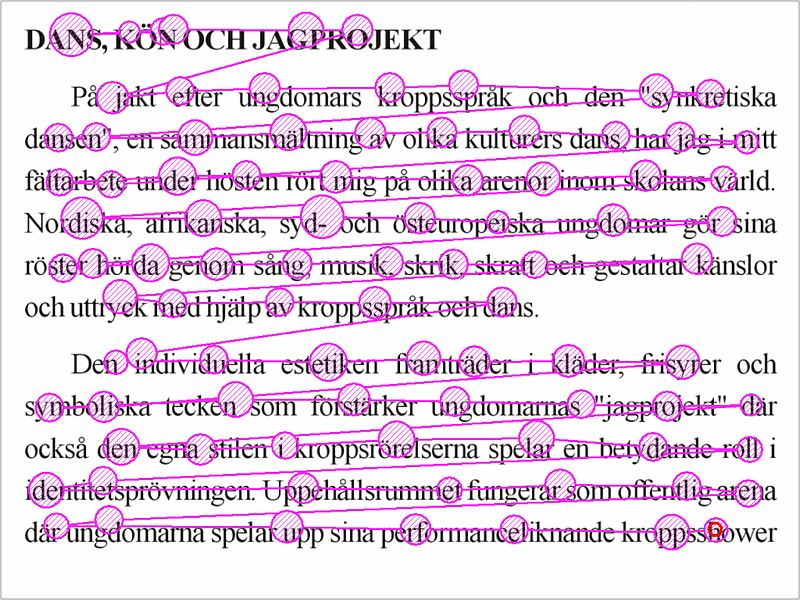
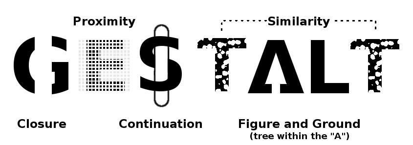

```{r setup, include=FALSE}
knitr::opts_chunk$set(echo = FALSE)

library(tidyr)
library(ggplot2)
library(dplyr)
library(gridExtra)
library(purrr)
library(grid)
library(nullabor)

theme_set(theme_bw(base_size = 14))
```


# Outline

- Human Visual System 
    - Hardware
    - Software
        - From retina to mental representation
        - Design choices & Bugs
- Statistical Graphics
    - Simple Graphs
    - Additional Complexity
    
---

# Human Visual System

---
layout: true
style: primary

## Hardware

---
### Main Questions:
- How does information get from the world to the brain?
- What are the sensory limitations of human vision?


---


???

Starting at the beginning - here's the structure of the eye. For our purposes, there are only a couple of structures that matter here:
- Retina - all of the optical cells that pass visual info to the brain
- Fovea - an area of the retina with very high density of color sensors
- Optic nerve - a bundle of neurons that passes information from the retina to the brain

---


???

A picture of my retina - you can see the fovea and blind spot marked. There are no receptors in the area of the blind spot, which is  where the optic nerve connects to the retina.

---


???

Here's a close-up of some retinal cells. Rods are cells which react to light intensity - how much light/dark is present? Cones respond to light wavelength (color). There are 3 types of cones - short, medium, and long cones. Signals from rods and cones are passed to bipolar cells, which aggregate the signals from rods, and then to ganglion cells, which pass the information down the optic nerve. 

---


???

This shows the wavelengths of light the cells in your retina respond to. 

Short cones respond to blue light, Medium cones respond to green/yellow light, and Long cones respond to red light.

We have the best discrimination of colors around the yellow/green/red area of the "rainbow" - why?

- Our sun is yellow
- Plants tend to be green, fruits are green/yellow/reddish
- very few purple people eaters as predators

As a result, the visual system doesn't perceive all colors equally well. Rainbow gradient color schemes are awful, even if you happen to have good color vision.

---
layout:true
## Software: Initial Processing

---
### Main Questions:
- How does the brain interpret raw sensory information from the optic nerve?
- What "programs" are responsible for critical graph-reading features?
- How do "bugs" in the visual system affect graph perception?

---
### Step 1: Selective Attention

- Focusing the fovea on a particular object of interest
- "Saccades" are small jumps between focus points



???

If input isn't changing constantly, cells "habituate" and stop sending information. Saccades are present even when you're staring intently at something.

---
### Step 2: Feature Encoding

- Preattentive Features
    - Encoded automatically, without additional attention required
    - Generally processed in parallel
- Attentive Features
    - Require specific attention to each object/feature combination
    - Processed serially


---
### Step 2: Feature Encoding

```{r parallel-serial, fig.width = 8, fig.height = 4, out.width = "100%"}

# Empty theme definition
new_theme_empty <- theme_bw(base_size = 12)
new_theme_empty$line <- element_blank()
new_theme_empty$strip.text <- element_blank()
new_theme_empty$axis.text <- element_blank()
new_theme_empty$axis.title <- element_blank()
new_theme_empty$plot.margin <- structure(c(0, 0, 0, 0), unit = "lines", valid.unit = 3L, class = "unit")


parallel.points <- data.frame(
  color = c(
    "red", "orange", "yellow", "green", "blue",
    "grey90", "grey70", "grey50", "grey30", "grey10"
  ),
  shape = 16,
  x = rep(1:5, times = 2),
  y = rep(c(4.25, 3.75), each = 5)
)

gen.angles <- function(angle1 = runif(1, 0, pi), angle2 = runif(1, 0, pi / 2), length = 1, x = 0, y = 0) {
  line1 <- data.frame(
    x = x,
    xend = x + length * cos(angle1),
    y = y,
    yend = y + length * sin(angle1)
  )
  line2 <- data.frame(
    x = line1$xend,
    xend = line1$xend + length * cos(angle2),
    y = line1$yend,
    yend = line1$yend + length * sin(angle2)
  )
  pacman <- rbind(line1, line2)
  pacman[, 1:2] <- pacman[, 1:2] - mean(range(unlist(pacman[, 1:2]))) + x
  pacman[, 3:4] <- pacman[, 3:4] - mean(range(unlist(pacman[, 3:4]))) + y
  pacman
}

gen.slopes <- function(angle = runif(1, 0, pi), length = .5, x = 0, y = 0) {
  data.frame(
    x = x - length * cos(angle) / 2,
    xend = x + length * cos(angle) / 2,
    y = y - length * sin(angle) / 2,
    yend = y + length * sin(angle) / 2
  )
}

angle.set <- sample(seq(0, pi / 2, length.out = 5), 5)
ystart <- 1 - sample(seq(.25, .625, length.out = 5), 5)
yend <- ystart + sample(seq(.2, 1, length.out = 5), 5)
parallel.segments <- bind_rows(
  bind_rows(lapply(1:5, function(i) gen.slopes(x = i, angle = angle.set[i], length = .5, y = 2))), # slope
  bind_rows(lapply(1:5, function(i) gen.angles(x = i, length = .5, y = 3))), # angles
  data.frame(x = 1:5, xend = 1:5, y = ystart, yend = yend) # length
)

parallel <-
  ggplot() +
  new_theme_empty +
  geom_point(aes(x = x, y = y, color = color, shape = shape), data = parallel.points, size = 8) +
  scale_shape_identity() + scale_color_identity() +
  geom_segment(aes(x = x, xend = xend, y = y, yend = yend), data = parallel.segments) +
  geom_text(aes(x = 0, y = c(1:3, 3.75, 4.25), label = c("Length", "Slope", "Angle", "Value", "Color")), hjust = 0, vjust = .5) +
  ggtitle("Parallel Detection")

serial.points <- data.frame(
  x = c(rep(1:5, times = 2), 3.75, 1.85),
  y = c(rep(c(4.25, 3.75), each = 5), 2, 2.2),
  shape = c(15, 16, 17, 8, 3, rep(16, 5), 1, 5),
  size = c(rep(8, 5), c(4, 6, 8, 10, 12), 8, 8)
)

serial.lines <- data.frame(
  x = jitter(
    c(
      cos(c(seq(0, pi, length.out = 5), rev(seq(pi, 0, length.out = 5)))) / 2 + 1.5,
      seq(2.5, 3.25, length.out = 4), 3.5, 3.5, rev(seq(2.5, 3.25, length.out = 4)),
      seq(4, 5, length.out = 3), rev(seq(4, 5, length.out = 4)), seq(4, 5, length.out = 3)
    )
  ),
  y = c(
    sin(seq(pi / 2, 3 * pi / 2, length.out = 10))^2 / +3,
    sin(seq(pi / 2, 3 * pi / 2, length.out = 10)) / 2 + 3,
    rnorm(10, 3, .25)
  ),
  group = rep(1:3, each = 10)
)

serial.lines2 <- serial.lines %>%
  split(.$group) %>%
  purrr::map_df(function(.) {
    xspline <- data.frame(spline(x = 1:nrow(.), y = .$x, n = 100), group = unique(.$group))
    yspline <- data.frame(spline(x = 1:nrow(.), y = .$y, n = 100), group = unique(.$group))

    tmp <- data.frame(x = xspline$y, y = yspline$y, group = yspline$group)
    tmp$y <- (tmp$y - mean(tmp$y)) / (max(tmp$y) - min(tmp$y)) / 1.5 + 3
    return(tmp)
  })

serial.rects <- data.frame(
  xmin = c(1.5, 2.3, 2.6),
  xmax = c(5, 4.5, 3.25),
  ymin = c(1.6, 1.8, 1.9),
  ymax = c(2.4, 2.2, 2.15)
)

serial.segments <- data.frame(
  x = c(seq(1.45, 2, length.out = 4), seq(2.5, 3.25, length.out = 4), rep(4.25, 4)),
  xend = c(seq(1.45, 2, length.out = 4), seq(3, 3.75, length.out = 4), rep(5, 4)),
  y = c(rep(.625, 4), rev(seq(.5, .9, length.out = 4)), seq(.75, 1.25, length.out = 4)),
  yend = c(rep(1.375, 4), rev(seq(1, 1.4, length.out = 4)), seq(.75, 1.25, length.out = 4))
)


serial <- ggplot() + new_theme_empty +
  geom_point(aes(x = x, y = y, size = size, shape = shape), data = serial.points) +
  geom_path(aes(x = x, y = y, group = group), data = serial.lines2, color = "black") +
  geom_rect(aes(xmin = xmin, xmax = xmax, ymin = ymin, ymax = ymax), data = serial.rects, fill = "transparent", color = "black") +
  geom_segment(aes(x = x, xend = xend, y = y, yend = yend), data = serial.segments) +
  scale_shape_identity() +
  scale_size_identity() +
  geom_text(aes(x = 0, y = c(4.25, 3.75, 3, 2, 1), label = c("Shape", "Area", "Curvature", "Containment", "Orientation")), hjust = 0, vjust = .5) +
  ggtitle("Serial Detection")

grid.arrange(parallel, serial, ncol = 2)
```

---
background-image: url(images/dalmation.png)
background-position: 100% 0%
background-size: 60%
### Step 3: Perceptual Organization

<!--https://www.pexels.com/photo/dalmatian-sitting-white-surface-933498/-->

.large[What do you see?]

--

- A bunch of splotches?

--

- A blue triangle?

--

- A dog wearing a bandana?

--

Your brain organizes stimuli in the     
simplest way possible, using any    
available context clues

---
### Step 3: Perceptual Organization

> "The whole is greater than the sum of the parts"



???

Gestalt heuristics are used to organize the world around us.

Dimension reduction issues: 3D world, 2D retina = information loss. There are infinitely many different 3D scenes that can produce a 2D projection, and infinitely many 2D projections from the same scene (lighting, angle). The brain has to handle this intelligently...

---
background-image: url(images/DuckRabbitIllusion.jpg)
background-position: 100% 20%
background-size: 30%
### Step 4: Visual Memory

.center[.large[What do you see?]]

---
background-image: url(images/DuckRabbitIllusion.jpg)
background-position: 100% 20%
background-size: 30%
### Step 4: Visual Memory

- Memories are stored as "gist" - the idea of the thing,     
rather than the actual perception
- Most people don't have photographic memory
    - Ambiguous images are stored as they were perceived at the time

- Memory of an image is reasonably accurate - semantic context stored with graphical memory

---
layout:true
## Software: Design Choices & Bugs

---
### Logarithmic Perception

$$ \frac{\triangle S}{S} = K $$

--

- The smallest detectable difference between two sensory stimuli is proportional to the magnitude of the stimulus.    
Holds for weight, color, sound, light intensity, and more

--

- More efficient compression of stimuli over limited bandwidth    
.small[See Varshney and Sun (2013) - "Why do we perceive logarithmically"]

---
### Optical Illusions

- Physiological Illusions    
occur due to receptor "wiring"

.center[  ]

---
### Optical Illusions

- Gestalt heuristic illusions    
occur due to perceptual grouping mechanisms

Figure/Ground Illusion | Kanizsa triangle 
---------------------- | ----------------
 | 


---
### Optical Illusions

- Depth perception illusions    
occur when 3D experience is applied to 2D stimuli

Muller-Lyer | Color-constancy
----------- | ---------------
 | 

---
### Optical Illusions

- Depth perception illusions

```{r sine-illusion, echo = F, fig.width = 6, fig.height = 4, out.width = "70%", dpi = 300}
data_frame(
  x = seq(0, 4*pi, length.out = 60),
  ymin = 2*sin(x) - 1,
  ymax = 2*sin(x) + 1
) %>%
  ggplot() + 
  geom_segment(aes(x = x, xend = x, y = ymin, yend = ymax)) + 
  coord_equal() + 
  theme_minimal() + 
  theme(axis.text = element_blank(), axis.title = element_blank()) + 
  ggtitle("Sine Illusion")
```

---

# Statistical Graphics

---
layout:true
## Simple Graph Perception

