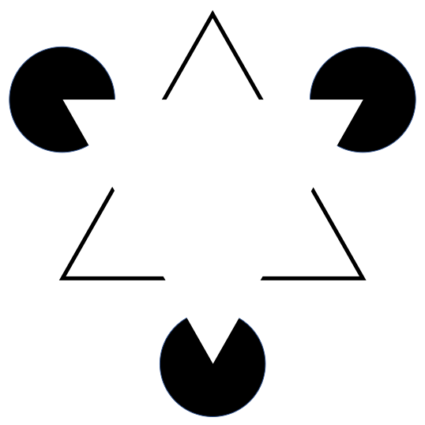

```{r setup, include=FALSE}
knitr::opts_chunk$set(echo = FALSE)
library(tidyverse)
library(gridExtra)
```

## Clusters Beat Trend!? Testing Feature Hierarchy in Statistical Graphics

### Susan VanderPlas
### Iowa State University


<!-- 
We're not good at processing information in raw form - graphics increase the bandwidth and allow us to see things in the data that are not obvious from looking at the numbers alone.
-->

## Graphics and Perception

> The greatest value of a picture is when it forces us to notice what we never expected to see.

John Tukey

## {.fullpage}
<!-- 
This is the Hertzsprung-Russell Diagram, which shows the temperature and brightness of stars. As stars age, in most cases they lose brightness and begin to cool, progressing along the main sequence. 

This simple scatterplot provided an incredible amount of information about stars as they age - the data had been available for many years in tabular form, but once it was plotted, the data was transformed into useable information.
-->

```{r HR-diagram, message = F, warning = F, echo = F}
# download.file("https://github.com/astronexus/HYG-Database/blob/master/hygfull.csv?raw=true", destfile = "stars.csv")
stars <- read_csv("stars.csv")

stars <- stars %>%
  mutate(Spectral.Class = str_extract(Spectrum, "^.") %>%
           str_to_upper() %>%
           factor(levels = c("O", "B", "A", "F", "G", "K", "M"), ordered = T),
         EarlyLate = str_extract(Spectrum, ".(\\d)") %>%
           str_replace_all("[A-z]", "") %>% as.numeric(),
         Temp = 4600*(1/(.92*ColorIndex + 1.7) + 1/(.92*ColorIndex) + 0.62)) %>%
  filter(!is.na(Spectral.Class) & !is.na(EarlyLate) & !is.na(Hip)) %>%
  arrange(Spectral.Class, EarlyLate) %>%
  mutate(SpectralClass2 = paste0(Spectral.Class, EarlyLate) %>% factor(., levels = unique(.)))

ggplot(data = filter(stars, Distance < 500)) + 
  # annotate(x = -.25, xend = .75, y = -2, yend = -6.5, arrow = arrow(ends = "both", length = unit(.1, "cm")), geom = "segment", color = "grey") + 
  annotate(x = 0.125, xend = 2, y = 4.25, yend = 4.25, arrow = arrow(ends = "both", length = unit(.1, "cm")), geom = "segment", color = "grey") + 
  geom_point(aes(x = ColorIndex, y = -AbsMag, color = Spectral.Class), alpha = .5) + 
  scale_x_continuous("B-V Color Index", breaks = c(0, .5, 1, 1.5, 2), labels = c("Hot  0.0       ", "0.5", "1.0", "1.5", "           2.0  Cool")) + 
  scale_y_continuous("Absolute Magnitude (Brightness)", breaks = c(-8, -4, 0, 4), labels = c(8, 4, 0, -4)) + 
  scale_color_manual("Spectral\nClass", values = c("#2E478C", "#426DB9", "#B5D7E3", "white", "#FAF685", "#E79027", "#DA281F")) + 
  annotate(x = .25, y = -5.5, label = "Dwarfs", geom = "text", angle = -25, color = "white") + 
  annotate(x = .5, y = -3.75, label = "Main Sequence", geom = "text", angle = -28) + 
  annotate(x = 1.125, y = 0, label = "Giants", geom = "text") + 
  annotate(x = 1, y = 4.5, label = "Supergiants", geom = "text", color = "white") +
  theme(panel.background = element_rect(fill = "grey10"), legend.key = element_rect(fill = "grey20")) + 
  ggtitle("Hertzsprung-Russell Diagram") + 
  coord_cartesian(xlim = c(-.25, 2.25), ylim = c(-12, 7)) + 
  guides(color = guide_legend(override.aes = list(alpha = 1)))
```

<!-- 
What is it about graphics that facilitates this information processing? 
Do the aesthetics used impact the conclusions we draw?

We know that certain features are processed automatically, without any extra effort on our part - color, line orientation, and shape are examples.
-->

## Gestalt Laws of Perception

<div class = "double">
<p class = "double-flow">
<blockquote>The whole is different than the sum of the parts</blockquote>
    
</p>
<p class="double-flow">
<ul><li>Rules that make sense of complex visual information using experience</li>
<li>Information organized hierarchically</li>
<li>Subconscious process to order and group visual input</li>
</p>
</div>

## Gestalt Plots
```{r gestalt1, echo =FALSE, out.width='100%', fig.width=8, fig.height=3, fig.show='hold'}
x1 <- rnorm(25, mean=4, sd=0.5)
x2 <- rnorm(25, mean=0, sd=0.5)
y1 <- rnorm(25, mean=1, sd=0.5)
y2 <- rnorm(25, mean=2, sd=0.5)
p1 <- qplot(c(x1,x2), c(y1,y2)) + theme_bw() + xlab("x") + ylab("y") + 
  theme(axis.title = element_blank(), axis.text = element_blank()) + 

x <- rnorm(60)
y <- rnorm(60)
group <- rep(1:4, length=60)
p2 <- qplot(x,y, color=factor(group%/%2), shape=factor(group%/%2)) + theme_bw() + xlab("x") + ylab("y") + scale_color_brewer(palette="Set1") + theme(legend.position="none") + 
  theme(axis.title = element_blank(), axis.text = element_blank())

x1 <- runif(50,-.75,1.25)
y1 <- x1^2 - x1 + rnorm(50, sd=0.1)
x2 <- runif(25,-.75,1.25)
y2 <- x2 + rnorm(25, sd=0.1)

p3 <- qplot(c(x1,x2),c(y1,y2)) + theme_bw() + xlab("x") + ylab("y")  + 
  theme(axis.title = element_blank(), axis.text = element_blank())

grid.arrange(p1, p2, p3, nrow = 1)
```